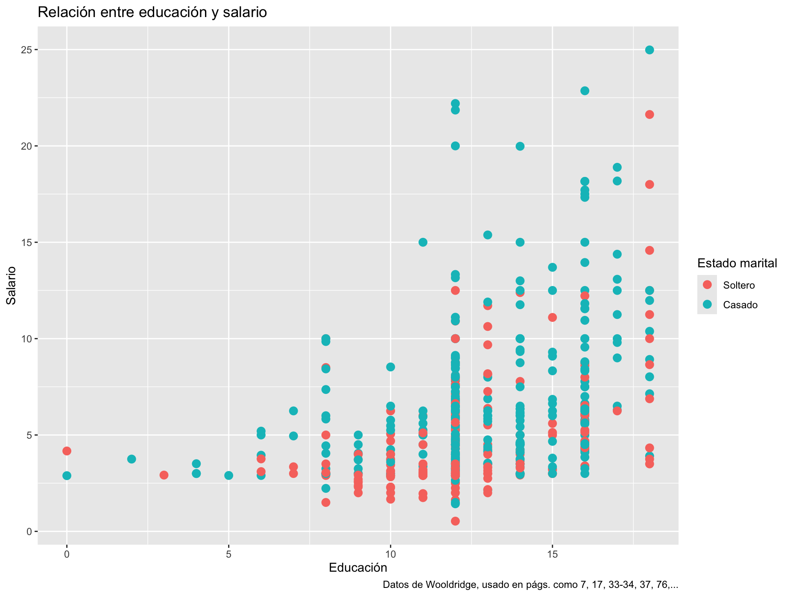

**Inferencia estadística**

Este taller está basado en elementos y ejemplos del libro de Rafael Irizarry,
[aquí](https://rafalab.dfci.harvard.edu/dslibro), así como pedazos del curso de la
Universidad de la República, en Uruguay, disponible en esta página de [RPubs de
RStudio](https://rpubs.com/lercy/930251) y este repaso sobre modelos longitudinales por
Alessio Crippa también en [RPubs de
RStudio](https://rpubs.com/alecri/review_longitudinal). Recomiendo complementar el
análisis con el libro *Data Analysis Using Regression and Multilevel/Hierarchical Models*
de Andrew Gelman y Jennifer Hill.

*Si aún no has instalado R, está [aquí](http://cran.us.r-project.org/). Acto seguido,
[baja RStudio](https://posit.co/download/rstudio-desktop/). Puedes también ir a la nube
[en Posit Cloud](https://posit.cloud/).*

# Recapitulando

La vez anterior, tomamos un recorrido a través de distintos tipos de visualizaciones. En
efecto, una buena visualización puede demostrar bastante sobre elementos en nuestros
estudios. Por ejemplo

```{r Cargando datos de Wooldridge}
library(wooldridge)

data(wage1)
head(wage1)

```

¿Qué aprendemos de ver estos datos así? ¿Podemos rápidamente determinar a si años de
educación se traducen a mayores ingresos? ¿Podemos determinar si afecta, en algo, la
relación marital? Para muchos humanos, es difícil extraer información con meramente mirar
a números sin contexto adicional. Pero podríamos ver algo en este gráfico



Vivimos en una era de creciente disponibilidad de conjuntos de datos informativos y de
herramientas de software, con lo cual el uso de visualizaciones ha aumentado en diversos
espacios: académicos, gubernamentales, organizaciones sociales, prensa, e industrias
varias. Sin embargo, R, un programa estadístico diseñado para el manejo y análisis de
distintos formatos de datos, tenemos un sinnúmero de opciones para trabajar distintos
tipos de complejidades en datos y análisis.

En esta secuencia de cuatro semanas, continuamos de lo aprendido en el pasado; aplicaremos
funciones para cargar datos, manipularlos, y retomamos problemas que visualizamos la
semana pasada como el señalado, para analizarlos con análisis estadísticos y
visualizaciones relativas a la inferencia estadística. De una vez estaremos entrando en
algunos de los diagnósticos que podremos desplegar para evaluar qué tan adecuado es un
modelo para trabajar ciertos datos. Aprenderemos hoy:

1.  Varias operaciones estadísticas,

2.  Estadística inferencial, en sus varias versiones para modelos simples, lineales,
    jerárquicos y longitudinales.

3.  Gráficos y pruebas que ayuden a entender y diagnosticar los modelos estadísticos que
    usaremos.

# Modelos estadísticos

Queríamos entender la vez anterior la relación de ingreso con otras variables. Para cargar
los datos escribiremos

```{r}
library(wooldridge)
base <- wage1
#View(base) 
names(base)
#?wage1
```

Las variables que utilizaremos son las siguientes:

-   wage: salario promedio por hora.

-   educ: años de educación.

-   exper: años de experiencia potencial.

-   tenure: años con el empleador actual (antigüedad).

-   nonwhite: es igual a 1 si la persona no es blanca, 0 si no.

-   female: es igual a 1 si la persona es mujer, 0 si no

-   married: es igual a 1 si la persona es casada, 0 si no.

En primer lugar queremos cambiar el nombre de la variable que está en la posición 4:

```{r}
names(base)[4] <- "antigüedad"
names(base)[24] <- "antigüedadcuad"

```

Por ahora lo que nos interesaba es un subconjunto de variables, todas de la 1 a la 7 (la
4.ª ha quedado como antigüedad), la 22 (log. de salario), la 23 (experiencia al cuadrado)
y la 24 (la antigüedad al cuadrado).

```{r, Selección de variables}
base1 <- base[,c(1: 7, 22:24)] 
```

Veremos ahora las primeras filas

```{r}
head(base1, n = 10)
```

También podríamos llamarlos con el nombre de variable

```{r, subconjuntos básicos}
datos1 <- base[,c("wage","educ","exper", "antigüedad" )] 

head(datos1, n = 5)
```

o como cubrimos al tocar `tidyverse`, la función `select()`

```{r, Select()}
library(tidyverse)
colnames(base)
datos2 <- base |> 
  dplyr::select(wage, educ, exper, antigüedad) #¿qué pasa si no tengo la especificación?
head(datos2, n=7)


```

Si solamente quisiéramos los datos de los casados podríamos usar la función de filtrado

```{r, Sólo casados}
datos3 <- base |> 
  dplyr::select("wage", "educ", "exper", "antigüedad", "married") |> 
  filter(married == 1)
```

# Correlaciones

Para investigar si hay correlación entre alguna de las variables se puede realizar un
gráfico en el que se presenta la dispersión para cada par de variables.

```{r, Correlaciones}
plot(datos2)
```

Y también calcular la matriz de correlaciones de las variables que figuran en *datos2*.

```{r, Correlaciones 2}
cor(datos2)
```

Notamos que existe una correlación positiva entre el salario y la educación (0.4059)

Crearemos el diagrama de dispersión entre salario y educación utilizando las funciones de
la librería ggplot2.

```{r}
ggplot(datos2, aes(x = educ, y = wage)) + 
  geom_point() + theme_light() +
  ggtitle("Relación entre salario y educación")
```

Se acordarán que la vez anterior añadimos complicaciones como un nivel adicional en la
capa de color:

```{r}
wage1 |> 
  mutate(marital = factor(married, levels = c(0, 1), labels = c("Soltero", "Casado"))) |> 
  ggplot(aes(educ, wage)) +  geom_point(aes(colour = marital), size = 3)+
  labs(title="Relación entre educación y salario",
       x = "Educación", 
       y = "Salario",
       color = "Estado marital",
       caption = "Datos de Wooldridge, usado en págs. como 7, 17, 33-34, 37, 76,...")

```

Esto lo exploraremos más al entrar en modelos de regresión lineal *múltiple*. Empezaremos
por el modelo de regresión lineal *simple*.

# Modelo de regresión lineal simple

Estimamos un modelo de regresión lineal simple, con el método mínimos cuadrados ordinarios
(en adelante MCO, OLS en inglés) que explique los salarios en función de los años de
educación de las personas. En R esto se hace con la función `lm()`:

```{r, MCO}
mod1 <- lm(wage ~ educ, data=datos2)
summary(mod1) # para imprimir la salida
```

¿Cómo se lee esta salida? La primera línea indica la fórmula que se utilizó. La segunda es
sobre la distribución de residuos las diferencias entre los valores observados de `wage` y
los valores predichos por el modelo. La mediana cercana a cero indica que los residuos
están centrados alrededor de cero. El rango de los residuos sugiere que hay algunos
valores atípicos, especialmente en el extremo máximo (16.6085), lo que podría indicar la
presencia de salarios excepcionalmente altos no explicados completamente por el modelo.

Vamos a los coeficientes: la información se presenta a través de varias columnas. La
columna de `Estimate` tiene el valor estimado de coeficientes ($\hat{\beta}$, mientras que
la columna de `Std. Error` nos da en promedio lo que varía el estimado en relación a la
variable dependiente. Esto es de utilidad para computar intervalos de confianza y
establecer la métrica con la cual determinar la hipótesis la existencia de una relación
entre una variable y otra. El puntaje t reporta la distancia estandarizada en distribución
t de nuestro coeficiente, en relación a la posibilidad de que tuviera cero efecto.
Mientras mayor sea el número de puntaje, y se mantuvieran relativamente mayores en
relación al error estándar indica que una relación existe. La última columna provee el
valor p, probabilidad asociada al puntaje t, que indica la probabilidad de estar viendo un
valor tan extremo como el reportado por azar.

El intercepto de -0.9 representa el salario promedio cuando los años de educación son
cero. Sin embargo, en la práctica, es poco común que una persona tenga cero años de
educación (o que tenga ingreso negativo por un trabajo), por lo que este valor tiene una
interpretación limitada. El valor p es algo elevado (es decir, supera los niveles
utilizados normalmente como corte para evitar errores tipo 1), lo que indica que no
podríamos afirmar con certeza su diferencia de cero. Por otro lado, el coeficiente en
educación indica que cada año en educación (una unidad adicional) se traduciría en un
aumento de 0.54136 unidades en salario (si son pesos, pues 54 chavos). El valor p es bajo
(o el puntaje t es elevado, distante a 2, y mucho mayor que el error estándar), lo que
indica con cierta certeza que el estimado no es cero. Vemos esto acompañado con
asteriscos, simbolizando el nivel de significancia, atado al valor seleccionado $\alpha$,
el punto de corte anteriormente mencionado.

El modelo luego continúa reportando otros diagnósticos generales:

-   `Residual standard error` (Error estándar de los residuos): más o menos 3.378

    -   Indica la variabilidad promedio de los residuos; en otras palabras, mide la
        precisión del modelo. Los modelos lineales incluyen un término estocástico, que
        captura las desviaciones de nuestra relación predicha con las observaciones. En
        este caso, el valor de 3.378, sugiere que las predicciones individuales del
        salario pueden variar en promedio ±3.378 unidades del valor real a través del
        espacio de nuestras observaciones.

-   `Degrees of freedom` (Grados de libertad): 524 -- Calculado como el número de
    observaciones menos el número de parámetros estimados (n - k). El objeto utilizado
    para análisis tenía 526 filas, y estimamos la pendiente y el intercepto.

-   El coeficiente de determinación ($R^2$) nos da 0.1648, que indica que el 16.48% de la
    variabilidad se explica con el modelo: es decir una proporción de la varianza
    explicada. El *R cuadrado ajustado* es similar, pero penaliza la inclusión de términos
    adicionales, algo que el $R^2$ no hará: al seguir añadiendo variables, $R^2$ seguirá
    aumentando, sean buenas o no las adiciones; el $R^2$ *ajustado* es preferido para
    análisis en regresión múltiple.

-   El estadístico F y el valor p global evalúa la hipótesis nula de que todos los
    coeficientes sean iguales a cero.

Al objeto creado para almacenar el modelo lineal le podemos hacer análisis varios. Por
ejemplo, podríamos hacerle el análisis de varianzas. Este se calcula con la función
`anova()`:

```{r}
anova(mod1) # para imprimir el análisis de varianzas
```

Este análisis descompone la variabilidad total de la variable dependiente (`wage` en este
caso) en componentes atribuibles al modelo y a los residuos. ¿Para qué haríamos esto?
Quizás en este caso simple no parezca muy revelador (aunque da más detalles, por ejemplo,
sobre el cómputo que lleva al puntaje F, viendo). Si tenemos variables categóricas con más
de dos niveles, podremos aclarar más el impacto de la variable en general, en lugar de
meramente entender la diferencia de distintos grupos en referencia a un valor base.

El objeto creado a través de la función `lm()`, de clase lm, tiene en sí doce componentes:

```{r, adentro del modelo}
names(mod1)

```

Se puede acceder a ellos como a las variables dentro de un objeto, utilizando el operador
`$` entre el objeto y el elemento. Por ejemplo, para extraer los coeficientes estimados se
escribe lo siguiente:

```{r, coeficientes}
mod1$coefficients

coef(summary(mod1))
```

Notemos que la función de `coef`, que extrae coeficientes de objetos creados por funciones
de modelaje estadístico, nos retorna una matriz con cuatro columnas y la cantidad de filas
adecuadas para los parámetros estimados, en este caso dos.

Una variación podría ser:

```{r}
coefficients(mod1)

summary(mod1)$coefficients #noten, es igual en resultado a la función de coef(summary(modelo))
```

Para consultar la estimación de un coeficiente de regresión se utilizan *corchetes [ ]* y
se indica la ubicación del mismo dentro de la salida del `summary()`. Por ejemplo, al alfa
gorro o sombrerito (es decir, $\hat{\alpha}$, alfa estimado) se podría sacar llamando a la
*[primera fila, primera columna]*:

```{r}
ahat <- coef(summary(mod1))[1,1]
ahat
```

Y el beta gorro $\hat{\beta}$ o beta estimado se podría obtener llamando a la *[segunda
fila, primera columna]*:

```{r}
bhat <- coef(summary(mod1))[2,1]
bhat
```

Del modelo podemos sacar también:

```{r}
coeficientes <- mod1$coefficients #vector de coeficientes estimados
ygorro <- mod1$fitted.values #valores predichos
resid <- mod1$residuals #residuos
#los valores estimados o predichos también se pueden sacar con la función predict():
ygor1<- predict(mod1) 
head(ygor1)
head(ygorro)
all.equal(ygor1, ygorro)
```

Agregaremos al conjunto de datos original, las predicciones, en este caso salario
estimado, con la función `predict()`.

```{r}
datos2$predicciones <- predict(mod1) 
head(datos2, 6)
```

El gráfico de dispersión puede establecerse

```{r}
ggplot(datos2, aes(x = educ, y = wage)) + 
  geom_point() +
  geom_smooth(method = 'lm', formula = y ~ x, se = FALSE, col = 'dodgerblue1') +
  theme_light() +
  ggtitle("Relación entre salario y educación")
```

Si quisiéramos un gráfico de dispersión interactivo, podemos usar plotly. Así,
posicionándose encima de cada observación, se ven los valores de (x, y) para cada uno de
los individuos. Para construir dicho gráfico se necesita la función ggplotly() del paquete
plotly.

```{r}
library(plotly)

ggplotly(data = datos2, x = ~ educ, y = ~ wage)
```

## Supuestos de modelos lineales

Ahora, a la hora de evaluar si nuestro modelo es bueno, además de los estimados que vimos
sobre el ajuste del modelo o su capacidad explicativa de la varianza, tenemos que revisar
las asunciones o presunciones que hace un modelo sobre los datos que evalúa. En la
evaluación de un modelo lineal, tenemos cinco.

1.  **Linealidad**: La relación entre las variables dependiente (y) e independiente(s) (x)
    debe ser lineal en los parámetros. Esto significa que el modelo es lineal en los
    coeficientes, aunque las variables en sí mismas puedan estar transformadas (por
    ejemplo, mediante logaritmos).

2.  **Independencia de los errores**: Los residuos o errores (la diferencia entre los
    valores observados y los valores predichos por el modelo) deben ser independientes
    entre sí. Esto significa que no debe haber correlación entre los errores.

3.  **Homoscedasticidad**: La varianza de los errores debe ser constante a lo largo de
    todos los valores de las variables independientes. Esto implica que la dispersión de
    los residuos debe ser más o menos la misma a lo largo del rango de valores de la
    variable independiente. En caso de heteroscedasticiddad, las estimaciones se tornan
    ineficientes y los errores estándar incorrectos.

4.  **Normalidad de los errores**: Los errores deben seguir una distribución normal. Este
    supuesto es importante para la realización de pruebas de hipótesis y la construcción
    de intervalos de confianza. Cabe señalar que en este caso, los estimadores de los
    coeficientes siguen siendo insesgados incluso si los errores no fueran normales. La
    falta de normalidad afecta principalmente la inferencia estadística.

5.  **No multicolinealidad**: Las variables independientes no deben estar altamente
    correlacionadas entre sí. La multicolinealidad puede dificultar la estimación precisa
    de los coeficientes de regresión.

De violarse estas presunciones, el modelo estará sesgado y sus resultados no serán del
todo fiables.

Podremos revisar algunos de estos a través de varios métodos: Podemos por ejemplo calcular
los residuos del modelo simple y los agregamos al conjunto de datos (*datos2*) de la
siguiente forma:

```{r}
datos2$residuos <- datos2$wage - datos2$predicciones

head(datos2, 5)
```

Esto es lo mismo que R hace internamente, y se puede llamar con la función `residuals`:

```{r}
datos2$residuosmod <- residuals(mod1)
head(datos2, 5)
```

Comparamos los residuos calculados manualmente con los que nos dio el modelo. Otra forma
de extraerlos es llamando con acceso `$` en el objeto a los residuos. `mod1$residuals` es
equivalente a `residuals(mod1)`. Sin embargo, utilizar la función `residuals()` es
generalmente preferible porque es más compatible con diferentes tipos de modelos y objetos
en R.

Añadimos al gráfico el elemento de los valores estimados de y, $\hat{y}_i$, en rojo y
muestro los residuos $\hat{\varepsilon}_i$:

```{r}
ggplot(datos2, aes(x = educ, y = wage)) +
  geom_point() +
  geom_segment(aes(xend = educ, yend = predicciones), color = 'red', linetype = 'dashed') +
  geom_point(aes(y = predicciones), color = 'red') +
  geom_smooth(method = "lm", se = FALSE, color = "lightgrey") +
  theme_light() +
  labs(title = "Salario vs Educación con Residuos", x = "Educación", y = "Salario")
```

Podemos realizar un gráfico de dispersión para inspeccionar de forma gráfica los residuos.

```{r}
plot(datos2$residuos)
```

El comando `plot(datos2$residuos)` simplemente grafica los residuos en función de su
índice, lo cual puede no ser muy informativo (aunque ciertamente se aprecia algún patrón
aglomerándose mucho por debajo de cero, y dispersándose hacia valores más altos). Sería
más útil graficar los residuos contra los valores predichos o contra la variable
independiente para detectar patrones que indiquen violaciones de los supuestos del modelo.

```{r}
ggplot(datos2, aes(x = predicciones, y = residuos)) +
  geom_point() +
  geom_hline(yintercept = 0, linetype = "dashed", color = "red") +
  theme_minimal() +
  labs(title = "Residuos vs Valores Predichos", x = "Valores Predichos", y = "Residuos")
```

Hasta ahora vemos problemas en la dispersión de los residuos, pues no parecen estar
dispersos como ruido alrededor de cero. Podríamos mejorar esto algo al ver la asimetría
(skewness) de la distribución

```{r}
library(e1071)  # para la función skewness
par(mfrow = c(1, 2))  # divide el área de gráficos en 2 columnas

plot(density(datos2$wage), main = "Gráfico de densidad: salario", ylab = "Frecuencia", sub = paste("Asimetría:", round(e1071::skewness(datos2$wage), 2)))  # density para 'salario'

polygon(density(datos2$wage), col = "red")

plot(density(datos2$residuos), main = "Gráfico de densidad: residuos", ylab = "Frecuencia", sub = paste("Asimetría:", round(e1071::skewness(datos2$residuos), 2)))  # density para los 'residuos'

polygon(density(datos2$residuos), col = "red")
```

Volveremos más tarde con la resolución de este problema, pero por ahora continuaremos con
este modelo tal cual para mostrar otros elementos útiles.

## Predicciones con estimados

Generaremos la predicción puntual y el intervalo de confianza para una educación promedio
en años.

```{r}
mean(datos2$educ)
```

Primero, calculamos el salario esperado para una persona con la educación promedio que es
12.56 años: $\hat{y} = \hat{\beta}_0 + \hat{\beta}_1 \bar{x}$.

```{r}
sal_pred <- ahat + bhat * 12.56274
sal_pred
```

La función predict() se puede igual usar para obtener la predicción puntual:

```{r}
nuevo <- data.frame(educ = mean(datos2$educ))
sal_pred <- predict(mod1, newdata = nuevo)
sal_pred
```

Ahora, calculamos la predicción y los intervalos para una persona con 15 años de educación
para ilustrar cómo varían estos valores con diferentes niveles de educación. Entonces
($𝑥=15$). El argumento `interval = prediction` devuelve el valor para la predicción
puntual junto a su intervalo de predicción, que estima el rango en el cual caerá una nueva
observación individual con un cierto nivel de confianza.

```{r}
nuevo <- data.frame(educ = 15)
future_y <- predict(object = mod1, newdata = nuevo, interval = "prediction", level = 0.95)
future_y
```

Si desean obtener solo la predicción puntual, pueden omitir el argumento `interval`.

Luego, generamos el intervalo de confianza para $𝐸(𝑦\mid𝑥)$. en este caso, debemos cambiar
el argumento a `interval = "confidence"`. El intervalo de confianza es para la media
esperada de la variable dependiente dado un valor específico de la independiente, aquí 15
años de educación.

```{r}
future_esp_y <- predict(object = mod1, newdata = nuevo, interval = "confidence", level = 0.95)
future_esp_y <- as.data.frame(future_esp_y)

IC_inf_esp_y <- future_esp_y$lwr
IC_sup_esp_y <- future_esp_y$upr
```

Agregando los pedazos

```{r}
# Calcular intervalos de predicción para todas las observaciones
future_y_all <- predict(object = mod1, newdata = datos2, interval = "prediction", level = 0.95)
future_y_all <- as.data.frame(future_y_all)

# Calcular intervalos de confianza para todas las observaciones
future_esp_y_all <- predict(object = mod1, newdata = datos2, interval = "confidence", level = 0.95)
future_esp_y_all <- as.data.frame(future_esp_y_all)

# Combinar todos los datos en un solo data frame
nuevos_datos <- cbind(datos2, future_y_all, 
                      IC_inf_esp_y = future_esp_y_all$lwr, 
                      IC_sup_esp_y = future_esp_y_all$upr)
```

Finalmente, generamos los gráficos correspondientes con los intervalos de confianza para
la predicción puntual (`IC_y`) y para el valor esperado (`IC_esp_y`) con el siguiente
código:

```{r}
IC_y <- ggplot(nuevos_datos, aes(x = educ, y = wage)) +
  geom_point() +
  geom_line(aes(y = lwr), color = "red", linetype = "dashed") +
  geom_line(aes(y = upr), color = "red", linetype = "dashed") +
  geom_smooth(method = lm, formula = y ~ x, se = TRUE, level = 0.95, col = 'blue', fill = 'pink2') +
  theme_light() + 
  ggtitle("Predicción de y al 95%")

IC_esp_y <- ggplot(nuevos_datos, aes(x = educ, y = wage)) +
  geom_point() +
  geom_line(aes(y = IC_inf_esp_y), color = "blue", linetype = "dashed") +
  geom_line(aes(y = IC_sup_esp_y), color = "blue", linetype = "dashed") +
  geom_smooth(method = lm, formula = y ~ x, se = FALSE, col = 'blue') +
  theme_light() + 
  ggtitle("Intervalo de Confianza de E(y|x) al 95%")
```

Imprimimos los gráficos uno al lado del otro, para poder compararlos mejor. ¿Cuál de los
dos tiene mayor amplitud?

```{r}
library(gridExtra)

grid.arrange(IC_esp_y, IC_y, ncol = 2, nrow = 1)
```

Al comparar ambos gráficos, observamos que el intervalo de predicción es más amplio que el
intervalo de confianza. Esto es esperado, ya que el intervalo de predicción considera la
variabilidad adicional de las observaciones individuales, mientras que el intervalo de
confianza se centra únicamente en la precisión de la estimación del valor medio esperado.

Veamos, a través de la comparación de dos gráficos el impacto que tiene el nivel de
confianza en la amplitud de los intervalos. Para ello, tendremos que descargar e instalar
algunas librerías. Se presenta primero el código y luego los gráficos obtenidos.

```{r}
# Instalar y cargar las librerías necesarias si no las tiene
#install.packages("jtools")
#install.packages("gridExtra")
library(jtools)
library(gridExtra)

# Crear los gráficos con diferentes niveles de confianza
a <- plot_summs(mod1, scale = TRUE, plot.distributions = FALSE, ci_level = 0.99) +
  ggtitle("Intervalos de confianza al 99%")

b <- plot_summs(mod1, scale = TRUE, plot.distributions = FALSE, ci_level = 0.95) +
  ggtitle("Intervalos de confianza al 95%")

c <- plot_summs(mod1, scale = TRUE, plot.distributions = FALSE, ci_level = 0.90) +
  ggtitle("Intervalos de confianza al 90%")

d <- plot_summs(mod1, scale = TRUE, plot.distributions = FALSE, ci_level = 0.70) +
  ggtitle("Intervalos de confianza al 70%")

# Mostrar los gráficos uno debajo del otro
grid.arrange(a, b, c,d, ncol = 2, nrow = 2)
```

Al comparar los gráficos, observamos que un nivel de confianza más alto (99%) produce
intervalos más amplios, ya que estamos buscando abarcar una mayor proporción de posibles
valores verdaderos de los coeficientes. Por el contrario, ir bajando hacia un nivel de
confianza menor (70%) resulta en intervalos más estrechos.

# Regresión múltiple

En esta sección, queremos evaluar cómo varias variables independientes se relacionan con
una variable dependiente. Específicamente, analizaremos cómo la educación y la antigüedad
influyen en el salario. Luego añadiremos otras variables adicionales, como señaláramos más
temprano:

-   wage: salario promedio por hora.

-   educ: años de educación.

-   exper: años de experiencia potencial.

-   tenure: años con el empleador actual (antigüedad).

-   nonwhite: es igual a 1 si la persona no es blanca, 0 si no.

-   female: es igual a 1 si la persona es mujer, 0 si no

-   married: es igual a 1 si la persona es casada, 0 si no.

Digamos que queremos evaluar la relación de varias variables con la dependiente. Podemos
calcular las correlaciones de los pares de variables, indicando que queremos trabajar con
3 decimales:

```{r}
round(cor(base1, method = "pearson"), 3)

```

Antes de estimar el modelo de regresión múltiple, es útil explorar las relaciones entre
las variables mediante la matriz de correlaciones. Esto nos ayuda a detectar posibles
problemas de multicolinealidad y a entender las relaciones bivariadas. En este caso,
haremos una restricción a tres variables, ayudando a mejorar la legibilidad.

```{r}
# Seleccionamos las variables de interés
variables_interes <- base1[, c("wage", "educ", "antigüedad")]

# Calculamos la matriz de correlaciones y redondeamos a 3 decimales
matriz_correlaciones <- round(cor(variables_interes, method = "pearson"), 3)
matriz_correlaciones
```

Interpretación:

-   Salario y Educación: Un coeficiente positivo indica que a mayor nivel educativo, el
    salario tiende a ser mayor. La fuerza de esta relación parece ser moderada, 0.406.
-   Salario y Antigüedad: Un coeficiente positivo sugiere que con más años de antigüedad,
    el salario también aumenta. Parece ser de una fuerza similar a educación.
-   Educación y Antigüedad: El coeficiente es negativo, y pequeño. Entre estas variables
    la relación no es clara en fuerza pero parecen ir en direcciones opuestas. Es menos
    probable que haya multicolinealidad entre estas variables independientes.

Para visualizar la relación conjunta entre las tres variables, utilizamos gráficos
tridimensionales.

```{r}
library(ggplot2)
library(plotly)
attach(base1)
plot_ly(x = educ, y = antigüedad, z = wage, type = "scatter3d", color = wage) |> 
  layout(scene = list(xaxis = list(title = 'educación (en años)'),
                      yaxis = list(title = 'antigüedad (en años)'),
                      zaxis = list(title = 'Salario (en USD/h)')))
```

Este gráfico interactivo permite rotar y explorar la relación entre las variables desde
diferentes ángulos, facilitando la identificación de patrones. El próximo es menos
interactivo, pero logra un efecto similar:

```{r}
library(scatterplot3d)
graf <- scatterplot3d(x = educ, y = antigüedad, z = wage, pch = 16, 
              cex.lab = 1, highlight.3d = TRUE, type = "h", 
              xlab = 'Años de educación',
              ylab = 'Antigüedad (años)', 
              zlab = 'Salario (USD/h)')
```

En este caso, las líneas verticales ayudan a visualizar la posición de cada punto en el
espacio tridimensional.

Ahora, estimamos un modelo de regresión lineal múltiple para cuantificar el efecto de la
educación y la antigüedad en el salario.

```{r}
# Estimamos el modelo de regresión múltiple
mod2 <- lm(wage ~ educ + antigüedad, data = base1)

# Resumen del modelo
summary(mod2)
```

La salida es similar al modelo anterior, con filas adicionales para cada coeficiente
estimado adicional. El intercepto o constante representa el salario promedio cuando la
educación y la antigüedad son cero (interpretación limitada en este contexto). Educ indica
el cambio esperado en el salario por cada año adicional de educación, manteniendo
constante la antigüedad en su valor esperado. Antigüedad muestra el cambio esperado en el
salario por cada año adicional de antigüedad, manteniendo constante la educación. En este
caso vemos que un año adicional de educación se traduce a unos 57 chavos adicionales en
ingreso, mientras que antigüedad añade cerca de 19 chavos al ingreso.

Todos los coeficientes reportan valores t relativamente grandes en relación a sus errores
estándar, y rechazamos en cada caso la hipótesis nula de no ser significativamente
distinto a un efecto nulo. Notamos que tanto $R^2$ y $R^2$ *ajustado* han aumentado ambos,
aunque la distancia entre ambos ahora es algo más notable: duplicamos la varianza
explicada.

¿Cómo se ve esto? Añadimos el plano de regresión al gráfico 3D para visualizar cómo el
modelo ajusta los datos.

```{r}
graf <-  scatterplot3d(x = educ, y = antigüedad, z = wage, pch = 16, 
                     cex.lab = 1, highlight.3d = TRUE, type = "h", 
                     xlab = 'Años de educación',
                     ylab = 'Experiencia (años)', 
                     zlab = 'Salario (USD/h)')

graf$plane3d(mod2, lty.box = "solid", col = 'mediumblue')
```

El plano representa las predicciones del modelo para diferentes combinaciones de educación
y antigüedad. Podemos observar qué tan bien el plano ajusta a los datos reales, intentando
cortar por un espacio vectorial estimado linealmente.

El ANOVA nos permite evaluar la significancia global del modelo y la contribución de cada
variable independiente.

```{r}
anova(mod2)
```

-   Sumas de Cuadrados (Sum Sq): Indican la variabilidad explicada por cada variable
    independiente y la variabilidad residual.

Para garantizar la validez de nuestro modelo de regresión múltiple, es fundamental
verificar que se cumplen los supuestos básicos del modelo lineal. A continuación,
revisaremos cada uno de estos supuestos en el orden mencionado anteriormente, aplicando
pruebas diagnósticas y proporcionando interpretaciones detalladas.

## Análisis de suposiciones

Antes evaluamos elementos de los residuos, pero lo hicimos por encima. R tiene en forma
base unos gráficos que ayudan a informarnos sobre si los modelos tienen problemas en cómo
están siendo aplicados.

Primero, podemos evaluar el modelo gráficamente con la función `plot()`:

```{r}
plot(mod2)
```

1.  Residuos vs Ajustados (Residuals vs Fitted):

-   Qué muestra: Este gráfico representa los residuos estandarizados en función de los
    valores ajustados por el modelo.

-   Interpretación: Sirve para detectar patrones no lineales y evaluar la homogeneidad de
    la varianza (homocedasticidad). Si los puntos se distribuyen aleatoriamente alrededor
    de la línea horizontal (residuo = 0) sin formar patrones, indica que el modelo es
    adecuado. Patrones sistemáticos o formas específicas (como una curva) sugieren que el
    modelo no captura adecuadamente la relación entre las variables, o que existe
    heterocedasticidad.

2.  Gráfico Q-Q Normal (Normal Q-Q Plot):

-   Qué muestra: Compara la distribución de los residuos estandarizados con una
    distribución normal teórica.
-   Interpretación: Evalúa la normalidad de los residuos, un supuesto clave en modelos
    lineales. Si los puntos siguen aproximadamente una línea recta, los residuos se
    distribuyen normalmente. Desviaciones significativas de la línea recta indican que los
    residuos no son normales, lo que puede afectar la validez de los intervalos de
    confianza y pruebas de hipótesis.

3.  Escala-Ubicación (Scale-Location Plot):

-   Qué muestra: Grafica la raíz cuadrada de los residuos estandarizados
    `(sqrt(\|Residuos estandarizados\|))` frente a los valores ajustados.
-   Interpretación: Ayuda a verificar la homocedasticidad. Una dispersión uniforme de
    puntos sugiere varianza constante de los residuos. Si los puntos muestran un patrón
    (por ejemplo, se ensanchan o estrechan a lo largo del eje de los ajustados), indica
    heterocedasticidad, lo que puede afectar la eficiencia de los estimadores.

4.  Residuos Estandarizados vs Apalancamiento (Residuals vs Leverage):

-   Qué muestra: Muestra los residuos estandarizados frente al apalancamiento de cada
    observación, con curvas de distancia de Cook superpuestas.
-   Interpretación: Identifica observaciones influyentes que tienen un gran impacto en el
    ajuste del modelo. Puntos con alto apalancamiento y residuos grandes pueden
    distorsionar los resultados. Las líneas de distancia de Cook ayudan a detectar estos
    puntos. Observaciones más allá de estas líneas merecen una revisión adicional.

Notamos que el modelo tiene sus problemas, violentando varios de los principios señalados
antes.

### Linealidad

*La relación entre las variables independientes y la variable dependiente es lineal*.

```{r}
# Gráficos de dispersión con línea de regresión para cada variable independiente
library(ggplot2)

ggplot(base1, aes(x = educ, y = wage)) +
  geom_point() +
  geom_smooth(method = "lm", col = "red") +
  labs(title = "Salario vs Educación", x = "Años de Educación", y = "Salario") +
  theme_minimal()

ggplot(base1, aes(x = antigüedad, y = wage)) +
  geom_point() +
  geom_smooth(method = "lm", col = "red") +
  labs(title = "Salario vs Antigüedad", x = "Años de Antigüedad", y = "Salario") +
  theme_minimal()
```

### Independencia de errores

Realizando la prueba de Durbin-Watson para verificar la autocorrelación estocástica. La
hipótesis nula es que los residuos no tienen autocorrelación (es posible una alternativa,
editando opciones), es decir que los residuos son normales.

```{r}
# Prueba de Durbin-Watson
library(lmtest)

dwtest(mod2)
```

En este caso la prueba rechaza la nula. Tenemos problemas en nuestros residuos tal cual
modelados al presente, pues se viola el supuesto de independencia.

### Homoscedasticidad

```{r}
# Gráfico de Residuos vs Valores Ajustados
ggplot(data = base1, aes(x = mod2$fitted.values, y = mod2$residuals)) +
  geom_point() +
  geom_smooth(method = "loess", col = "red", se = FALSE) +
  geom_hline(yintercept = 0, linetype = "dashed") +
  labs(title = "Residuos vs Valores Ajustados", x = "Valores Ajustados", y = "Residuos") +
  theme_minimal()

# Prueba de Breusch-Pagan
library(lmtest)
bptest(mod2)
```

Vemos una representación visual (con `ggplot()`) de los residuos contrastados a los
valores ajustados. La prueba Breusch Pagan tiene la hipótesis nula siguiente: varianza
constante. Por consiguiente, rechazarla es encontrar heteroscedasticidad.

### Normalidad de errores

El supuesto a verificar ahora (aunque no está yendo bien en general) es saber si los
errores se distribuyen normalmente. Hay varias opciones gráficas y con pruebas
estadísticas: el gráfico Q-Q Plot, el histograma de los residuos, el diagrama de densidad
de residuos, y la prueba Shapiro-Wilk.

```{r}
# Gráfico Q-Q de los residuos
qqnorm(mod2$residuals)
qqline(mod2$residuals, col = "red")

# Histograma de los residuos
hist(mod2$residuals, breaks = 20, main = "Histograma de Residuos", xlab = "Residuos", col = "lightblue")

# Gráfico de densidad de los residuos con asimetría
library(e1071)  # Para la función skewness()

plot(density(mod2$residuals), 
     main = "Gráfico de Densidad de Residuos", xlab = "Residuos", 
     sub = paste("Asimetría:", round(skewness(mod2$residuals), 2)))  
polygon(density(mod2$residuals), col = "red")
```

Por ejemplo, estos residuos distan de ser normales. Las cuantilas de los residuos distan
de la normalidad esperada, por *MUCHO*. Verificamos

```{r, Prueba Shapiro}
shapiro.test(mod2$residuals)
```

La hipótesis nula de la prueba de Shapiro-Wilk es que estamos ante normalidad en los
errores. Esto confirma lo sugerido por el análisis gráfico y estadístico precedente.

En los siguientes gráficos se muestran los residuos contra cada uno de los regresores, los
cuales se realizan con el siguiente código:

```{r}
plot1 <- ggplot(data = base1, aes(educ, mod1$residuals)) +
  geom_point() + 
  geom_smooth(color = "firebrick") + 
  geom_hline(yintercept = 0) +
  theme_bw()

plot2 <- ggplot(data = base1, aes(antigüedad, mod1$residuals)) +
  geom_point() + 
  geom_smooth(color = "firebrick") + 
  geom_hline(yintercept = 0) +
  theme_bw()

grid.arrange(plot1, plot2)
```

El análisis gráfico indica problemas de heteroscedasticidad y de correlación entre los
residuos y el nivel de los regresores.

### Multicolinealidad

```{r}
# Matriz de correlaciones entre variables independientes
vars_indep <- base1[, c("educ", "antigüedad")]
cor(vars_indep)

# Cálculo del VIF
library(car)
vif(mod2)
```

Los valores no son particularmente altos en correlación (alto es cerca de 1 ó -1, bajo es
cerca de 0). En nuestro caso, la correlación entre educación y antigüedad es baja
(-0.056), lo que sugiere baja multicolinealidad. La prueba del factor de inflación de
varianza (VIF) se puede usar para verificar numéricamente si hay multicolinealidad.

### Identificar observaciones influyentes

Aunque no es un supuesto básico, es importante identificar puntos que puedan influir
excesivamente en el modelo. Esto se puede verificar: - Analizando el gráfico de Residuos
Estandarizados vs Apalancamiento. - Calculando la Distancia de Cook.

```{r}
# Gráfico de Residuos Estandarizados vs Apalancamiento
plot(mod2, which = 5)

# Gráfico de Distancia de Cook
plot(mod2, which = 4)

# Identificar observaciones con alta Distancia de Cook
cooksd <- cooks.distance(mod2)
influential <- as.numeric(names(cooksd)[(cooksd > (4 / nrow(base1)))])
influential

# Mostrar las observaciones influyentes
base1[influential, ]
```

Puntos fuera de las líneas de referencia pueden ser influyentes. Los gráficos señalan los
valores que parecen distantes al resto de lo observado. En estos casos, se recomienda
revisar las observaciones para verificar si hay errores en los datos o si representan
casos especiales.

### Análisis de residuos contra variables independientes

Es útil graficar los residuos contra cada una de las variables independientes para
detectar patrones específicos.

```{r}
# Residuos vs Educación
plot1 <- ggplot(data = base1, aes(x = educ, y = mod2$residuals)) +
  geom_point() + 
  geom_smooth(method = "loess", color = "firebrick", se = FALSE) + 
  geom_hline(yintercept = 0, linetype = "dashed") +
  labs(title = "Residuos vs Educación", x = "Educación", y = "Residuos") +
  theme_bw()

# Residuos vs Antigüedad
plot2 <- ggplot(data = base1, aes(x = antigüedad, y = mod2$residuals)) +
  geom_point() + 
  geom_smooth(method = "loess", color = "firebrick", se = FALSE) + 
  geom_hline(yintercept = 0, linetype = "dashed") +
  labs(title = "Residuos vs Antigüedad", x = "Antigüedad", y = "Residuos") +
  theme_bw()

# Mostrar los gráficos lado a lado
library(gridExtra)
grid.arrange(plot1, plot2, ncol = 2)
```

-   Residuos vs Educación: Si observamos un patrón sistemático, podría indicar que la
    relación no es completamente lineal o que hay variables omitidas.
-   Residuos vs Antigüedad: Patrones similares pueden sugerir problemas de
    heterocedasticidad o relaciones no lineales.

### ¿Qué hacemos?

Como detectamos problemas de heterocedasticidad y normalidad de errores, podemos probar
transformando la variable dependiente. Por ahora añadiré unas variables adicionales y
también haremos unas variaciones con transformaciones (una de estas ya estaba en el
conjunto de datos). Es posible que al incorporar variables relevantes que puedan explicar
mejor la variabilidad en el salario, mejore el ajuste del modelo. Por otro lado, es
posible que transformar la variable dependiente o algunas independientes para corregir
violaciones a los supuestos del modelo lineal arreglen estos problemas.

A continuación, implementaremos estas estrategias paso a paso.

Añadiremos variables que podrían influir significativamente en el salario, como:

-   married: Estado civil (1 si está casado, 0 si no).
-   female: Género (1 si es mujer, 0 si es hombre).
-   nonwhite: Etnicidad (1 si no es blanco, 0 si es blanco).

```{r}
# Actualizamos el modelo añadiendo la variable 'married'
mod3 <- update(mod2, wage ~ educ + antigüedad + married)

# Resumen del modelo
summary(mod3)
```

-   Intercepto (-2.52575): Representa el salario promedio cuando educ, antigüedad y
    married son cero. Aunque no es interpretable en este contexto, es necesario para el
    modelo.
-   Educación (0.55614): Por cada año adicional de educación, el salario promedio aumenta
    en aproximadamente 56 chavos, manteniendo constantes la antigüedad y el estado civil.
-   Antigüedad (0.17482): Por cada año adicional de antigüedad con el empleador actual, el
    salario promedio aumenta en aproximadamente \$0.17, manteniendo constantes las otras
    variables.
-   Casado (0.89235): Estar casado se asocia con un aumento promedio de 89 chavos en el
    salario, manteniendo constantes la educación y la antigüedad.
-   Significancia estadística: Todos los coeficientes son estadísticamente significativos
    (p \< 0.05), lo que indica que tienen un efecto significativo en el salario.
-   Ajuste del modelo:
    -   R-cuadrado (0.3149): El modelo explica aproximadamente el 31% de la variabilidad
        en el salario, lo que es una mejora respecto a los modelos anteriores.
    -   Error estándar residual (3.066): Es menor que en los modelos previos, lo que
        indica un mejor ajuste.

Para visualizar los coeficientes del modelo, podemos utilizar la librería `modelsummary` y
la función `modelplot()`:

```{r}
library(modelsummary)
modelplot(mod3, coef_omit = "Intercept", color = "blue", size = 1) +
  labs(title = "Coeficientes del Modelo 3")
```

*Nota*: Al incluir variables categóricas como married, es importante considerar que sus
coeficientes representan diferencias respecto a la categoría de referencia.

#### Estandarización de Variables

Para comparar los efectos de las variables en la misma escala, podemos estandarizar las
variables numéricas:

```{r}
base1_estandarizado <- base1 |>
  mutate(across(where(is.numeric), scale))

# Ajustamos el modelo con los datos estandarizados
mod3_est <- lm(wage ~ educ + antigüedad + married, data = base1_estandarizado)

# Visualicemos los coeficientes estandarizados
modelplot(mod3_est, coef_omit = "Intercept", color = "blue", size = 1) +
  labs(title = "Coeficientes Estandarizados del Modelo 3")
```

Los coeficientes estandarizados permiten comparar directamente el efecto relativo de cada
variable en el salario. Un coeficiente más grande en valor absoluto indica un efecto
mayor.

Al ejecutar `plot(mod3)`, obtenemos los gráficos diagnósticos para evaluar los supuestos
del modelo.

```{r}
plot(mod3)
```

```{r}
#library(lmtest)
bptest(mod3)
shapiro.test(mod3$residuals)
```

Los residuos todavía siguen distando de ser una distribución normal. Ampliaremos el modelo
con otras variables que señaláramos antes como de interés.

```{r}
# Creamos un nuevo modelo incluyendo 'female' y 'nonwhite'
mod4 <- lm(wage ~ educ + antigüedad + married + female + nonwhite, data = base1)

# Resumen del modelo
summary(mod4)
```

-   Educación y antigüedad: Siguen siendo significativas y positivas.
-   Married (0.68258): Estar casado se asocia con un aumento promedio de \$0.68 en el
    salario, manteniendo constantes las demás variables.
-   Female (-1.71149): Ser mujer se asocia con una disminución promedio de \$1.71 en el
    salario, manteniendo constantes las demás variables. Este efecto es estadísticamente
    significativo.
-   Nonwhite (-0.06516): No es estadísticamente significativo (p = 0.8788), lo que sugiere
    que, en este modelo, la variable nonwhite no tiene un efecto significativo en el
    salario.
-   Ajuste del modelo:
    -   R-cuadrado (0.3653), ajustado (0.3592): El modelo explica aproximadamente el 36%
        de la variabilidad en el salario, mejorando levemente respecto al modelo anterior.

#### Análisis

Es importante verificar la multicolinealidad al añadir nuevas variables.

```{r}
#library(car)
vif(mod4)
```

No parece haber problema de multicolinealidad, todas están cerca de 1.

Verificaremos rápido igual los gráficos del modelo.

```{r}
plot(mod4)
```

```{r}
#library(lmtest)
bptest(mod4)
shapiro.test(mod4$residuals)
```

Seguimos rechazando la hipótesis nula de Shapiro-Wilk aún en este caso. El problema no
parece ser resuelto por añadidura de otros términos. Aplicamos una transformación
logarítmica a la variable dependiente, salario.

```{r}
# Estimamos el modelo con el logaritmo del salario
mod5 <- lm(log(wage) ~ educ + antigüedad + married + female + nonwhite, data = base1)

# Resumen del modelo
summary(mod5)
```

Interpretación:

Coeficientes interpretados en términos logarítmicos: - Educación (0.079483): Un año
adicional de educación se asocia con un aumento promedio del 7.95% en el salario,
manteniendo constantes las demás variables. - Antigüedad (0.019443): Un año adicional de
antigüedad se asocia con un aumento promedio del 1.94% en el salario. - Married
(0.146703): Estar casado se asocia con un aumento promedio del 14.67% en el salario. -
Female (-0.280401): Ser mujer se asocia con una disminución promedio del 28.04% en el
salario. - Nonwhite (-0.002419): No es significativo. - Mejora en los supuestos del
modelo: - La transformación logarítmica puede ayudar a corregir problemas de
heterocedasticidad y normalidad de los residuos.

```{r}
plot(mod5)
```

Estos gráficos se ven **distintos** a los anteriores. Los residuos parecen dispersarse de
manera más uniforme alrededor de cero. Hagamos varias pruebas para verificar:

```{r}
#library(lmtest)
bptest(mod5)
shapiro.test(mod5$residuals)
```

Sigue rechazándose la nula, aunque por menos margen que antes en el caso de Breusch-Pagan
(y menos mejorado en Shapiro-Wilk).

Haremos unos últimos intentos de ajuste, como el uso de errores estándar robustos (ajustan
las estimaciones de la varianza para corregir la heterocedasticidad sin cambiar los
coeficientes estimados).

```{r}
# Instalar y cargar los paquetes necesarios
#install.packages("lmtest")
#install.packages("sandwich")
library(lmtest)
library(sandwich)

# Recalcular los errores estándar usando la matriz de varianza-covarianza robusta
coef(summary(mod5))
coeftest(mod5, vcov = vcovHC(mod5, type = "HC1"))
```

Los coeficientes estimados permanecen iguales en este caso, pero los errores estándar y
los valores p pueden cambiar. Para más información sobre este método recomiendo [este
artículo](https://ideas.repec.org/p/ete/ceswps/ces0316.html).

Si quisiéramos hacer otras transformaciones adicionales, no satisfechos con estos errores
robustos, podríamos buscar una transformación Box-Cox, un tipo de transformación de
potencia que redistribuye la variable con un logaritmo y luego eleva a un exponente óptimo
para normalizar la variable. Para más información recomiendo [este
enlace](https://datasciencetut.com/box-cox-transformation-in-r/).

```{r}
# Instalar y cargar el paquete MASS
#install.packages("MASS")
library(MASS)

# Encontrar el lambda óptimo para la transformación Box-Cox
boxcox_mod <- boxcox(mod4, plotit = TRUE)
lambda_optimo <- boxcox_mod$x[which.max(boxcox_mod$y)]
lambda_optimo

# Aplicar la transformación Box-Cox al salario
base1$wage_boxcox <- (base1$wage^lambda_optimo - 1) / lambda_optimo

# Reestimar el modelo con la variable transformada
mod_boxcox <- lm(wage_boxcox ~ educ + antigüedad + married + female + nonwhite, data = base1)
summary(mod_boxcox)
# Verificar los supuestos nuevamente
shapiro.test(mod_boxcox$residuals)
bptest(mod_boxcox)
```

No rechazamos la hipótesis nula de homocedasticidad por Breusch-Pagan. La
heterocedasticidad se ha mitigado en este modelo. Sin embargo, rechazamos la hipótesis
nula de normalidad. Los residuos aún no siguen una distribución normal.

También podríamos incluir otros términos polinomiales o interacciones.

```{r}
# Modelo con términos cuadráticos
mod_poly <- lm(log(wage) ~ educ + I(educ^2) + antigüedad + I(antigüedad^2) + married + female + nonwhite, data = base1)

# Resumen del modelo
summary(mod_poly)

# Verificar los supuestos
shapiro.test(mod_poly$residuals)
bptest(mod_poly)
```

Tampoco rechazamos en esta transformación la hipótesis nula de homoscedasticidad. La
heteroscedasticidad se ha reducido. Pero sí volvemos a notar que los errores no son
normales. Soluciones como bootstrapping podrían ser útiles, así como modelos
generalizados. Por ahora, podemos enfocarnos en sacar las tablas de los modelos, para uso
en \LaTeX o para otros programas.

```{r}
library(stargazer)
stargazer(mod1,mod2,mod3,mod4,mod5,mod_boxcox) #de base, para LaTeX
```

```{r}
stargazer(mod1,mod2,mod3, type="text", title = "Resultados de regresión")
stargazer(mod4,mod5,mod_boxcox, type="text", title = "Resultados de regresión 2")#de base, para LaTeX
```

# Modelos lineales generalizados

Al trabajar con datos como los de salarios en el conjunto de datos de Wooldridge, podemos
encontrar problemas con las suposiciones fundamentales de los Mínimos Cuadrados Ordinarios
(OLS). Aunque los modelos lineales clásicos nos proporcionan resultados, estos pueden ser
problemáticos si los errores no están bien distribuidos, es decir, si violan los supuestos
de normalidad y homocedasticidad. Esto significa que las inferencias obtenidas pueden no
ser adecuadas o estar sesgadas.

Para abordar estas limitaciones, los Modelos Lineales Generalizados (GLM) extienden el
marco de los modelos lineales al permitir una mayor flexibilidad en la relación entre las
variables independientes y la variable dependiente. Un GLM se compone de tres elementos
clave:

1.  Predictor lineal ($\eta$): $\eta=𝑋𝛽$

Donde ***X*** es la matriz de variables independientes y **𝛽** es el vector de
coeficientes.

2.  Función de Enlace ($𝑔$): Esta es monótona y diferenciable en todo su dominio, y que
    transforma el predictor lineal $g(\mu) = \eta$. Su inversa permite obtener las
    predicciones de la variable dependiente: $𝑦̂ = 𝑔⁻¹(𝑋𝛽̂)$, $\hat{y} = g^{-1}(\eta)$).

3.  Distribución de Respuesta: La variable dependiente se asume que sigue una distribución
    de la familia exponencial, denotada por $f(y | \mu)$ . Algunas distribuciones comunes
    incluyen la normal, binomial, Poisson y gamma.

Estos componentes proporcionan la flexibilidad necesaria para modelar diferentes tipos de
variables dependientes, permitiendo que el modelo capture mejor las características de los
datos y aborde problemas como la heterocedasticidad y la no normalidad de los errores, así
como cuando el rango de la variable de respuesta está limitado, entre otros.

En R, la función glm() se utiliza para ajustar Modelos Lineales Generalizados. Esta
función permite especificar tanto la distribución de la variable dependiente como la
función de enlace adecuada.

**Sintaxis básica de glm()**

``` r
glm(formula, family = family_type(link = link_function), data = dataset)
```

-   `formula`: Especifica la relación entre las variables dependiente e independientes
    (similar a `lm()`).

-   `family`: Define la distribución de la variable dependiente. Puede ser `gaussian`
    (para regresión lineal), `binomial` (para regresión logística), `poisson` (para
    modelos de conteo), `gamma`, entre otros.

-   `link`: Es la función de enlace que conecta la media de la variable dependiente con
    las variables independientes (por ejemplo, `log`, `identity` o `inverse`).

La función de enlace predeterminada para una familia puede cambiarse especificando un
enlace a la función de familia. Si no se informa nada, el modelo correrá en la práctica un
modelo lineal simple. Comparen los resultados:

```{r}
glm(wage ~ educ + antigüedad + married, data = base1)
lm(wage ~ educ + antigüedad + married, data = base1)
```

Por ejemplo, si la variable de respuesta es no negativa y la varianza es proporcional a la
media, se usaría la función de enlace “identity” con la familia “quasipoisson”. Esto se
especificaría como:

``` r
family = quasipoisson(link = "identity")
```

La decisión sobre qué familia es apropiada no se discute a profundidad en esta secuencia,
pero estos pueden ser:

``` r
binomial(link = "logit")
gaussian(link = "identity")
Gamma(link = "inverse")
inverse.gaussian(link = "1/mu^2")
poisson(link = "log")
quasi(link = "identity", variance = "constant")
quasibinomial(link = "logit")
quasipoisson(link = "log")
```

-   gaussian: Para variables continuas que siguen una distribución normal (equivalente a
    la regresión lineal clásica).
-   binomial: Para variables categóricas binarias (regresión logística).
-   poisson: Para datos de conteo (números enteros no negativos).
-   Gamma: Para variables continuas y positivas, especialmente cuando la varianza aumenta
    con la media.
-   inverse.gaussian: Para variables continuas positivas con varianza que aumenta
    rápidamente con la media.

Algunas funciones de enlace comunes son: - identity: Sin transformación (usada en
regresión lineal). - log: Transforma la media mediante el logaritmo natural (útil para
variables positivas). - logit: Función logística, usada en regresión logística. - inverse:
Utiliza la inversa de la media.

Cada familia tiene una función de enlace predeterminada, pero puede modificarse según las
necesidades del análisis. Revisar la página de ayuda de `glm` y la documentacion de
objetos familiares para modelos ayudará en gran medida.

Volviendo al ejemplo que traíamos antes, queremos modelar el salario (wage), que es una
variable continua y positiva, y sospechamos que la varianza aumenta con la media. Podemos
utilizar la familia Gamma con una función de enlace logarítmica, a través de
`family = Gamma(link = "log")`:

```{r}
# Ajustando un modelo GLM con distribución gamma y enlace logarítmico
mod_glm <- glm(wage ~ educ + antigüedad + married + female + nonwhite, 
                 family = Gamma(link = "log"), data = base1)

# Resumen del modelo
summary(mod_glm)
```

Los coeficientes representan el efecto multiplicativo de las variables independientes
sobre el salario. Por pasos:

El intercepto se interpreta como el valor cuando las variables independientes son cero. En
este caso, el logaritmo del salario esperado es 0.6336. - Exponenciando el intercepto:
$exp(0.6336) ≈ 1.884$. - Esto significa que, para una persona con cero años de educación y
antigüedad, no casada, hombre y blanco, el salario promedio esperado es aproximadamente
\$1.88 por hora (recordemos, esto es de 1976).

Cada año adicional de educación se asocia con un incremento en el logaritmo del salario de
0.08177. Los coeficientes se han de exponenciar (y son multiplicativos, entendiéndose como
cambios porcentuales por unidad adicional).

```{r}
exp(coef(mod_glm))
```

Por ejemplo, por cada año adicional de educación, el salario promedio aumenta en
aproximadamente un 8.53%, manteniendo constantes las demás variables. En el caso de la
variable 'dummy', como female, el exponenciado es menos que uno. Esto implica que las
mujeres ganaban, en promedio, un 24.82% menos que los hombres, manteniendo constantes las
demás variables en el modelo. Otros elementos en las columnas del estimado son similares a
lo que vimos al usar `lm()`.

Sin embargo tenemos información adicional. Hay un parámetro de dispersión. Este es un
estimado de la varianza de los residuos en el modelo Gamma. Un valor más pequeño indica
menor variabilidad de los datos alrededor del modelo ajustado. La raíz cuadrada de ese
parámetro es la desviación estándar estimada. Las desviaciones nulas y residuales son
comparaciones entre un modelo vacío (con sólo un intercepto), y el modelo ajustado con
todas las variables.

En este caso reporta el criterio de información de Akaike, que es una medida de la calidad
del modelo que penaliza por la complejidad (número de parámetros). Al comparar modelos, un
AIC más bajo indica un modelo preferido. Como sólo tenemos un modelo, el AIC nos sirve
para comparar con futuros modelos alternativos. Finalmente, declara la cantidad de
Iteraciones que fueron necesarias para converger y encontrar los estimadores de máxima
verosimilitud.

Verifiquemos otra vez con el modelo transformado

```{r}
# Resumen del modelo
summary(mod5)
```

Notamos que la transformación aproxima los coeficientes a los conseguidos con el `glm()`.

```{r}
library(arm)

# Gráfico de coeficientes para el modelo GLM
coefplot(mod_glm, col.pts = "red", cex.pts = 1.5, main = "Comparación de Coeficientes")

# Añadimos los coeficientes del modelo OLS al mismo gráfico
coefplot(mod5, add = TRUE, col.pts = "blue", cex.pts = 1.5)

legend("topright", legend = c("GLM (Gamma con enlace log)", "OLS (log(wage))"), 
       col = c("red", "blue"), pch = 16)
```

## Análisis de la bondad del modelo

```{r}
# Generamos los gráficos diagnósticos
par(mfrow = c(2, 2))
plot(mod_glm)
```

Esto se ve posiblemente mejor que la variante de OLS, aunque tampoco parece perfecto.

# Modelos jerárquicos

Los modelos jerárquicos, también conocidos como modelos lineales mixtos o modelos
multinivel, son una extensión de los modelos lineales que permiten analizar datos en los
que las observaciones están agrupadas o anidadas en diferentes niveles. Estos modelos son
especialmente útiles cuando se espera que exista correlación entre las observaciones
dentro de los mismos grupos.

En este análisis, utilizaremos el paquete `lme4` en R, que es ampliamente utilizado para
ajustar modelos lineales mixtos. A continuación, te guiaré a través de los pasos para
ajustar y comprender estos modelos, explicando cada componente y resultado de manera
clara. La sintaxis de `lme4` se basa en la sintaxis de los modelos lineales que ya
conocemos de `lm()`.

La función `lmer()` de `lme4` añade la especificación de la variable de grupo/sujeto y de
la estructura de efectos aleatorios que se van a estimar. En paréntesis adicionales (ver
abajo), el término a la izquierda de `|` especifica los efectos aleatorios que se van a
estimar. El término a la derecha de `|` representa la(s) variable(s) que definen la
estructura de agrupación (o anidamiento) de los datos.

Un `1` en la parte izquierda del paréntesis significa que se debe estimar un componente de
varianza de intercepto aleatorio. Si también se coloca la variable predictora a la
izquierda de `|`, esto indica que se deben incluir pendientes aleatorias. La forma básica
de estos será:

``` r
lmer(data = datos, VarDependiente ~ VarIndependiente + (1 | VarGrupal))
```

Corresponde a un modelo que puede describirse de la siguiente manera: “La variable
dependiente es predicha por la variable independiente. Al mismo tiempo, la varianza de los
residuos de nivel 2 del intercepto es un parámetro del modelo”.

Comencemos con modelos HLM que incluyen solo variables predictoras de nivel 1 (individuos
anidados en grupos). Luego, en un segundo paso, añadiremos predictores de nivel 2.
Finalmente, analizaremos los modelos HLM de medidas repetidas, donde el nivel más bajo
(nivel 1) corresponde a observaciones repetidas dentro de los individuos, y esas
observaciones están anidadas en los participantes individuales (nivel 2).

Nos limitaremos aquí a modelos de 2 niveles. Los principios de los modelos HLM pueden
ilustrarse de manera bastante parsimoniosa de esta forma, y expandir los modelos a más de
dos niveles de análisis es bastante sencillo.

```{r}
# Cargar las librerías necesarias
#library(tidyverse)
library(lme4)
library(lmerTest)

# Cargar los datos desde una URL
df <- read_csv("https://raw.githubusercontent.com/methodenlehre/data/master/salary-data.csv")

# Convertir las variables 'firma' y 'sector' en factores
df <- df |>
  mutate(firma = as.factor(firma),
         sector = as.factor(sector))

# Ver las últimas filas del conjunto de datos
tail(df)
```

## Modelo nulo

En este caso saco unos datos de salarios de compañías ficticias en Suiza. Con `mutate()`
convertí las variables firma (empresa) y sector en factores, ya que representan
categorías. Antes de añadir predictores, ajustamos un modelo nulo que solo incluye el
intercepto y un término aleatorio para capturar la variabilidad entre las empresas
(firma). Este modelo nos permite estimar la correlación intraclase (ICC) y entender qué
proporción de la variabilidad total del salario se debe a diferencias entre empresas.

```{r}
library(Matrix)
library(lme4)
# Ajustar el modelo nulo con intercepto aleatorio por empresa
modelo_nulo <- lmer(salary ~ 1 + (1 | firma), data = df, REML = TRUE)

# Obtener las predicciones del modelo nulo
df$predicciones_nulo <- predict(modelo_nulo)

# Resumen del modelo
summary(modelo_nulo)
```

Explicación:

-   lmer(): Ajusta un modelo lineal mixto.
-   `salary ~ 1`: Indica que solo se ajusta el intercepto fijo (media general del
    salario).
-   `(1 | firma)`: Especifica un intercepto aleatorio para cada empresa (firma),
    capturando la variabilidad entre empresas.
-   `REML = TRUE`: Utiliza el método de Máxima Verosimilitud Restringida para estimar los
    parámetros, lo cual es apropiado cuando se comparan modelos con diferentes efectos
    fijos.
-   `predict()`: Genera predicciones del modelo para cada observación.

La varianza del intercepto aleatorio (firma) representa la variabilidad del salario
promedio entre empresas. Por otro lado la varianza residual captura la variabilidad del
salario dentro de las empresas. Calcularemos la correlación intraclase como la proporción
de la varianza total que se debe a diferencias entre empresas. Se define como:
$\rho = \frac{\sigma^2_{\text{Nivel-2}}}{\sigma^2_{\text{Nivel-2}} + \sigma^2_{\text{Nivel-1}}}$

```{r}
# Extraer las varianzas del modelo
var_intercepto <- as.numeric(VarCorr(modelo_nulo)$firma[1])
var_residual <- attr(VarCorr(modelo_nulo), "sc")^2

# Calcular la ICC
ICC <- var_intercepto / (var_intercepto + var_residual)
ICC
```

Correlación intraclase:
$\hat{\rho} = \frac{\hat{\sigma}^2_{υ_0}}{\hat{\sigma}^2_{υ_0} + \hat{\sigma}^2_{ϵ}} = \frac{851249}{851249 + 1954745} = 0.3034$

Es decir, 30% de la variabilidad total del salario se debe a diferencias entre empresas.
Existe una correlación notable entre los salarios de los empleados dentro de la misma
empresa, lo que justifica el uso de un modelo multinivel.

Con la función ranef() podemos ver los efectos aleatorios (residuos de segundo nivel del
intercepto):

```{r}
ranef(modelo_nulo)
```

Para determinar si la varianza entre empresas es estadísticamente significativa,
comparamos el modelo nulo con un modelo sin efectos aleatorios (modelo lineal simple).

```{r}
# Utilizar la función ranova() para comparar modelos
anova_aleatorio <- ranova(modelo_nulo)
anova_aleatorio
```

Este comparó el modelo actual con un modelo reducido que elimina el efecto aleatorio. El
valor p indica que incluir el intercepto aleatorio para firma mejora significativamente el
modelo. Aproximadamente, el 30% de la varianza total del salario se puede atribuir a
diferencias entre empresas.

## Modelo con predictor de primer nivel

Ahora, añadimos un predictor de nivel 1 (experience), que es una variable individual, al
modelo. Mantenemos el intercepto aleatorio para capturar la variabilidad entre empresas.

```{r}
# Ajustar el modelo con 'experience' como predictor fijo y intercepto aleatorio por empresa
modelo_intercepto_aleatorio <- lmer(salary ~ experience + (1 | firma), data = df, REML = TRUE)

# Obtener las predicciones del modelo
df$predicciones_intercepto_aleatorio <- predict(modelo_intercepto_aleatorio)

# Resumen del modelo
summary(modelo_intercepto_aleatorio)
```

Los resultados del modelo mixto muestran que el efecto fijo de la experiencia es
significativamente positivo, con un coeficiente estimado de $\hat{\gamma}_{10} = 534.34$ y
un valor $p$ menor a 0.001. Esto indica que, en promedio, el salario aumenta en
aproximadamente 534 unidades (por ejemplo, francos suizos) por cada año adicional de
experiencia, controlando por las diferencias entre empresas. El modelo incluye un
intercepto aleatorio a nivel de empresa (firma), lo que nos permite ajustar diferencias
entre las empresas en los salarios base.

Se le puede añadir un nivel adicional al modelo para tanto acomodar por un intercepto así
como pendiente aleatoria. Al aplicar este modelo la varianza (aleatoria) de la pendiente
de la variable independiente de primer nivel se puede estimar, dándonos una idea de las
diferencias en el efecto (pendiente) de experiencia en salario entre las unidades del
segundo nivel (firmas). Si comparamos los efectos entre este y el modelo anterior, vemos
la disminución marginal de la varianza del intercepto aleatorio en comparación con el
modelo nulo, lo que sugiere que parte de la variabilidad entre empresas se explica por la
experiencia de los empleados.

```{r}
fixef(modelo_intercepto_aleatorio)
ranef(modelo_intercepto_aleatorio)
```

## Modelo con pendientes aleatorias

Para investigar si el efecto de la experiencia en el salario varía entre empresas,
ajustamos un modelo que incluye tanto intercepto como pendiente aleatorios para
experience.

```{r}
# Ajustar el modelo con intercepto y pendiente aleatorios por empresa
modelo_coeficientes_aleatorios <- lmer(salary ~ experience + (experience | firma), data = df, REML = TRUE)

# Obtener las predicciones del modelo
df$predicciones_coeficientes_aleatorios <- predict(modelo_coeficientes_aleatorios)

# Resumen del modelo
summary(modelo_coeficientes_aleatorios)
```

En este caso `(experience | firma)` especifica que tanto el intercepto como la pendiente
de experience varían aleatoriamente entre empresas.

Los resultados muestran que el efecto fijo de la experiencia sigue siendo
significativamente positivo, con un coeficiente estimado de $\hat{\gamma}_{10} = 530.85$ y
un valor $p$ menor a 0.001. Esto indica que, en promedio, el salario aumenta en
aproximadamente 531 unidades (por ejemplo, CHF para estos datos ficticios) por cada año
adicional de experiencia. Una covarianza negativa sugiere que las empresas con salarios
base más altos tienden a tener incrementos más pequeños por año de experiencia, y
viceversa.

Para evaluar si el modelo con pendientes aleatorias proporciona un mejor ajuste que el
modelo con solo intercepto aleatorio, realizamos una comparación de modelos.

```{r}
# Ajustar el modelo con intercepto aleatorio (modelo reducido)
modelo_intercepto_aleatorio <- lmer(salary ~ experience + (1 | firma), data = df, REML = FALSE)

# Ajustar el modelo con intercepto y pendiente aleatorios (modelo completo)
modelo_coeficientes_aleatorios <- lmer(salary ~ experience + (experience | firma), data = df, REML = FALSE)

# Comparar los modelos utilizando ANOVA
anova(modelo_intercepto_aleatorio, modelo_coeficientes_aleatorios)
```

El p-valor pequeño indica que el modelo con pendientes aleatorias es significativamente
mejor que el modelo con solo intercepto aleatorio. Existe variación significativa en el
efecto de la experiencia en el salario entre empresas.

Para ayudar a comprender mejor los resultados, es útil visualizar cómo varía el efecto de
la experiencia en el salario entre empresas.

```{r}
#library(ggplot2)
# Extraer los coeficientes aleatorios
coeficientes_aleatorios <- coef(modelo_coeficientes_aleatorios)$firma

# Renombrar las columnas
colnames(coeficientes_aleatorios) <- c("Intercepto", "Pendiente")

# Añadir el identificador de la empresa
coeficientes_aleatorios$firma <- rownames(coeficientes_aleatorios)

# Graficar las pendientes de experiencia por empresa
ggplot(coeficientes_aleatorios, aes(x = reorder(firma, Pendiente), y = Pendiente)) +
  geom_bar(stat = "identity") +
  coord_flip() +
  labs(title = "Pendientes de Experiencia por Empresa",
       x = "Empresa",
       y = "Efecto de la Experiencia en el Salario") +
  theme_minimal()

# Crear un conjunto de datos con las predicciones del modelo
df$predicciones <- predict(modelo_coeficientes_aleatorios)

# Graficar los datos y las líneas de regresión por empresa
ggplot(df, aes(x = experience, y = salary, color = firma, group = firma)) +
  geom_point(alpha = 0.5) +
  geom_line(aes(y = predicciones)) +
  labs(title = "Relación entre experiencia y salario por empresa",
       x = "Experiencia",
       y = "Salario") +
  theme_minimal()
```

# Modelos longitudinales

Los modelos longitudinales son una herramienta estadística esencial para analizar datos en
los que se realizan observaciones repetidas de los mismos individuos a lo largo del
tiempo. Este tipo de análisis es fundamental en campos como la medicina, psicología,
economía, política, sociología y otras disciplinas donde es importante entender cómo
cambian las mediciones en los individuos o unidades a lo largo del tiempo y qué factores
influyen en esos cambios.

Los datos longitudinales son un caso especial de datos jerárquicos o multinivel, donde las
observaciones (mediciones) están anidadas dentro de individuos. En este contexto, las
observaciones repetidas de un mismo individuo tienden a ser más similares entre sí que las
observaciones de diferentes individuos. Esta correlación dentro de los sujetos es crucial
y debe ser tenida en cuenta para obtener inferencias estadísticas válidas. Una vista
general sobre paquetes útiles en R para analizar este tipo de datos correlacionados se
puede encontrar en la [CRAN Task View
dedicada](https://cran.r-project.org/web/views/MixedModels.html).

En este taller, exploraremos cómo ajustar y analizar modelos longitudinales utilizando R,
centrándonos en un conjunto de datos que mide el crecimiento dental en niños y niñas a
diferentes edades. Trabajaremos con un conjunto de datos que contiene medidas
longitudinales del crecimiento dental en 27 niños (16 niños y 11 niñas). Las medidas
corresponden a la distancia pituitaria-pterigomaxilar (una medida de crecimiento dental) y
se tomaron a las edades de 8, 10, 12 y 14 años. Nuestro objetivo es describir cómo cambia
esta distancia con la edad y comparar el patrón de crecimiento entre niños y niñas.

Primero, cargamos los datos y observamos su estructura:

```{r}
load(url("http://alecri.github.io/downloads/data/dental.RData"))
head(dental)
```

Los datos se presentan en formato ancho, donde las mediciones repetidas se encuentran en
columnas separadas para cada edad. Este formato no es ideal para el análisis longitudinal,
por lo que convertiremos los datos a un formato largo usando la función pivot_longer():

```{r}
library(labelled)   # etiquetado de datos
library(rstatix)    # estadísticas descriptivas
library(ggpubr)     # estadísticas descriptivas y gráficos convenientes
library(GGally)     # gráficos avanzados
library(car)        # útil para ANOVA/pruebas de Wald
library(Epi)        # fácil obtención de intervalos de confianza para coeficientes/predicciones del modelo
#library(lme4)       # modelos lineales de efectos mixtos
#library(lmerTest)   # pruebas para modelos lineales de efectos mixtos
library(emmeans)    # medias marginales
library(multcomp)   # intervalos de confianza para combinaciones lineales de coeficientes del modelo
library(geepack)    # ecuaciones de estimación generalizadas
library(ggeffects)  # efectos marginales, predicciones ajustadas
library(gt)         # tablas bonitas
dental_long <- pivot_longer(dental, cols = starts_with("y"), 
                            names_to = "measurement", values_to = "distance") |>
  mutate(
    age = parse_number(measurement),
    measurement = fct_inorder(paste("Medida a los", age))
  ) |>
  set_variable_labels(
    age = "Edad del niño/a al momento de la medición",
    measurement = "Etiqueta de medición temporal",
    distance = "Medición de distancia"
  )

head(dental_long)
```

Ahora, cada fila representa una medición de un individuo en una edad específica, lo que
facilita el análisis longitudinal. Antes de ajustar modelos, exploramos los datos de forma
descriptiva para entender las tendencias generales.

```{r}
group_by(dental_long, age) |> 
  get_summary_stats(distance)
```

Observamos que la distancia media aumenta con la edad, lo que sugiere un crecimiento
dental a medida que los niños y niñas crecen. Creamos un diagrama de caja para visualizar
la distribución de la distancia a cada edad:

```{r}
ggplot(dental_long, aes(measurement, distance, fill = measurement)) +
  geom_boxplot() +
  geom_jitter(width = 0.2) +
  guides(fill = "none") +
  labs(x = "Edad (años)", y = "Crecimiento dental, mm")
```

El gráfico muestra que la mediana y los valores de la distancia aumentan con la edad. La
dispersión también parece aumentar ligeramente, lo que indica mayor variabilidad en edades
superiores. Exploremos si hay diferencias en el crecimiento dental entre niños y niñas.

```{r}
group_by(dental_long, sex, measurement) |> 
  get_summary_stats(distance, show = c("mean", "sd"))
```

Y gráficamente

```{r}
ggplot(dental_long, aes(sex, distance, fill = measurement)) +
  geom_boxplot() +
  labs(x = "", y = "Crecimiento dental, mm", fill = "")

```

Visualmente, parece que los niños tienen, en promedio, una distancia ligeramente mayor que
las niñas en cada edad.

Evaluemos las correlaciones entre medidas de interés:

```{r}
ggpairs(select(dental, starts_with("y")), lower = list(continuous = "smooth"))
```

y separemos nuevamente por grupo (sexo)

```{r}
ggpairs(dental, mapping = aes(colour = sex,alpha = 0.5), columns = 3:6,
        lower = list(continuous = "smooth"))
```

Digamos que queremos entender si el efecto varía con el tiempo. Podríamos evaluar
gráficamente esto:

```{r}
group_by(dental_long, sex, age) |> 
  summarise(mean = list(mean_ci(distance)), .groups = "drop") |> 
  unnest_wider(mean) |> 
  mutate(agex = age - .05 + .05*(sex == "Boy")) |> 
  ggplot(aes(agex, y, col = sex, shape = sex)) +
  geom_point() +
  geom_errorbar(aes(ymin = ymin, ymax = ymax), width = 0.2) +
  geom_line() +
  labs(x = "Edad, en años", y = "Crecimiento dental medio, mm", shape = "Sex", col = "Sex")

ggplot(dental_long, aes(x = age, y = distance, color = sex)) +
  geom_point() +
  geom_line(aes(group = id)) +
  labs(x = "Edad (años)", y = "Crecimiento dental (mm)", color = "Sexo") +
  theme_minimal()
```

Para analizar los datos longitudinales, utilizamos modelos mixtos lineales, que permiten
modelar tanto los efectos fijos (comunes a todos los individuos) como los efectos
aleatorios (específicos de cada individuo).

## Modelo inicial

Ajustamos un modelo que considera la edad como factor categórico (variables indicadoras) y
un intercepto aleatorio para capturar la variabilidad entre individuos.

```{r}

# Ajustar el modelo mixto
modelo_edad <- lmer(distance ~ factor(age) + (1 | id), data = dental_long)

# Resumen del modelo
summary(modelo_edad)
```

En este caso el intercepto captura la distancia media dental a los 8 años (valor de
referencia). Esta es 22.18 mm. La diferencia entre las respuestas medias de los niños de
10 y 8 años es de 0.98 mm. La diferencia entre las respuestas medias de los niños de 12 y
8 años es de 2.46 mm. La diferencia entre las respuestas medias de los niños de 14 y 8
años es de 3.91 mm.

Esto indica que la distancia pituitaria-pterigomaxilar aumenta significativamente con la
edad, lo que es consistente con el crecimiento observado durante este período.

Usamos un análisis de varianza para evaluar si la edad tiene un efecto significativo en el
crecimiento dental.

```{r}
library(car)

Anova(modelo_edad)
```

El efecto de la edad es altamente significativo (p \< 0.001), indicando que la edad
influye en el crecimiento dental.

Calculamos las medias marginales estimadas para cada edad y sus intervalos de confianza.

```{r}
library(emmeans)

# Calcular las medias marginales
medias_edad <- emmeans(modelo_edad, ~ age)

# Mostrar los resultados
summary(medias_edad)
```

Las medias estimadas confirman que la distancia media aumenta con la edad, aumentando la
tasa de crecimiento en cada momento de medición. Podemos presentar la trayectoria estimada
del modelo ajustado utilizando la función predict:

```{r}
# Generar predicciones del modelo ajustado
predicciones <- predict(modelo_edad)

# Visualizar la trayectoria estimada
ggplot(dental_long, aes(x = age, y = distance, color = sex)) +
  geom_point() +
  geom_line(aes(y = predicciones, group = id), linetype = "dashed") +
  labs(x = "Edad (años)", y = "Distancia pituitaria-pterigomaxilar (mm)", color = "Sexo") +
  theme_minimal()
```

Este gráfico muestra tanto los datos reales de distancia en función de la edad como las
predicciones del modelo para cada niño, con líneas discontinuas que representan las
trayectorias estimadas a lo largo del tiempo.

## Modelo con variable de sexo

```{r}
# Ajustar el modelo con sexo y su interacción con la edad
modelo_sexo <- lmer(distance ~ factor(age) * sex + (1 | id), data = dental_long)

# Resumen del modelo
summary(modelo_sexo)
```

Interpretando salidas:

-   La varianza del Intercepto Aleatorio (id) es 3.285 con una desviación estándar de
    1.813. Existe variabilidad significativa entre los individuos en sus medidas iniciales
    de distancia dental.

-   La varianza residual es 1.975 con una desviación estándar de 1.405. Esta captura
    variabilidad no explicadas por el modelo.

-   El intercepto captura el ser una niña de 8 años como el punto de referencia:
    21.1818mm.

-   Coeficientes de factor(g)AA: El efecto de edad está dándonos el cambio en la distancia
    dental en comparación con la edad de referencia (8 años) para las niñas. Por ejemplo,
    las niñas de 10 años tienen, en promedio, una distancia dental 1.05 mm mayor que las
    niñas de 8 años, mientras que las de 14 años tienen, en promedio, una distancia dental
    2.91 mm mayor que las niñas de 8 años.

-   Coeficiente `sexBoy`: Los niños de 8 años tienen, en promedio, una distancia dental
    1.69 mm mayor que las niñas de 8 años. Esta es una variable dummy.

-   Los coeficientes de interacción indican cuánto cambia la diferencia entre niños y
    niñas en cada edad en comparación con la edad de referencia (8 años). Por ejemplo, a
    los 14 años, los niños tienen una distancia dental adicional de 1.68 mm en comparación
    con las niñas, más allá de la diferencia observada a los 8 años. Esa edad es la única
    que reporta distancias significativas a la referencia; al entrar más en la
    adolescencia las diferencias se tornan notables.

```{r}
Anova(modelo_sexo)
```

El efecto de la edad es altamente significativo. Esto indica que existen diferencias
significativas en la distancia dental media entre las diferentes edades (8, 10, 12 y 14
años), independientemente del sexo. También el sexo del paciente parece ser significativo.
La interacción entre edad y sexo es marginalmente significativa (p \< 0.10, pero \> 0.05).

# Series de tiempo: ejemplo de finanzas

Las series de tiempo son un conjunto de observaciones registradas en momentos sucesivos en
el tiempo, ordenadas cronológicamente. El análisis de series de tiempo es fundamental en
diversos campos como la economía, finanzas, meteorología, y ciencias sociales, ya que
permite comprender y predecir comportamientos futuros basados en datos históricos.

En esta ñapita del taller, me enfoco en el análisis de series de tiempo financieras,
específicamente en el estudio de los precios de las acciones. El objetivo es proporcionar
una guía clara y práctica sobre modelos de series de tiempo utilizando R.

Las series de tiempo financieras, como los precios de las acciones o los tipos de cambio,
son intrínsecamente volátiles y están influenciadas por múltiples factores económicos y
políticos. El análisis de estas series permite a los inversores y analistas comprender las
tendencias del mercado, evaluar riesgos, anticiparse a estas y tomar decisiones
informadas.

Para este análisis, utilizaremos datos históricos del precio de cierre ajustado de las
acciones de Apple Inc. (AAPL). Usaremos el paquete quantmod para descargar los datos
directamente desde Yahoo Finance.

```{r}
# Instalar paquetes si no están instalados
#install.packages("quantmod")
#install.packages("forecast")
#install.packages("tseries")
#install.packages("ggplot2")
#install.packages("quantmod", repos = "https://cloud.r-project.org/")

# Cargar los paquetes
library(quantmod)
library(forecast)
library(tseries)
library(ggplot2)
```

Descargamos los datos de los últimos cinco años.

```{r}
# Establecer el rango de fechas
fecha_inicio <- as.Date("2019-01-01")
fecha_fin <- as.Date(Sys.Date())

# Descargar los datos de AAPL
getSymbols("AAPL", src = "yahoo", from = fecha_inicio, to = fecha_fin)

# Ver las primeras filas
head(AAPL)
```

Extraemos la columna de precios de cierre ajustados y creamos un objeto de serie de
tiempo.

```{r}
# Extraer el precio de cierre ajustado
precio_cierre <- AAPL[, "AAPL.Adjusted"]

# Convertir a serie de tiempo
serie_tiempo <- ts(precio_cierre, frequency = 252)  # 252 días hábiles en un año
```

Antes de ajustar cualquier modelo, es importante entender las características de la serie
de tiempo.

```{r}
# Graficar la serie de tiempo
autoplot(serie_tiempo) +
  labs(title = "Precio de Cierre Ajustado de AAPL",
       x = "Tiempo",
       y = "Precio ($)") +
  theme_minimal()
```

El gráfico muestra la evolución del precio de AAPL desde 2019 hasta la fecha actual.
Observamos tendencias ascendentes y periodos de volatilidad, especialmente durante eventos
económicos significativos como la pandemia de COVID-19 y la subsiguiente alza en
valuaciones financieras.

Descomponemos la serie para analizar sus componentes: tendencia, estacionalidad y
residuales.

```{r}
# Verificar la estructura de 'serie_tiempo'
str(serie_tiempo)
# Convertir a vector numérico
precio_cierre_vector <- as.numeric(precio_cierre)

# Crear la serie de tiempo
serie_tiempo <- ts(precio_cierre_vector, frequency = 252)

# Descomposición utilizando STL (Seasonal and Trend decomposition using Loess)
descomposición <- stl(serie_tiempo, s.window = "periodic")

# Graficar la descomposición
autoplot(descomposición) +
  labs(title = "Descomposición de la Serie de Tiempo de AAPL")
```

-   Tendencia: Muestra el movimiento a largo plazo del precio.
-   Estacionalidad: En series financieras diarias, la estacionalidad puede no ser
    pronunciada, pero pueden existir patrones semanales o mensuales.
-   Residuales: Parte de la serie no explicada por la tendencia ni la estacionalidad.

La estacionariedad es una propiedad clave en el análisis de series de tiempo. Una serie
estacionaria tiene estadísticas (media, varianza) constantes en el tiempo. Realizamos la
prueba Dickey-Fuller Aumentada (ADF) para verificar si la serie es estacionaria.

```{r}
# Prueba ADF
adf.test(serie_tiempo, alternative = "stationary")
```

El p-valor es alto (mayor que 0.05), lo que indica que no podemos rechazar la hipótesis
nula de que la serie tiene una raíz unitaria (no estacionaria). Concluimos que la serie no
es estacionaria.

Para lograr estacionariedad, transformamos los precios en rendimientos logarítmicos.

```{r}
# Calcular los rendimientos logarítmicos
rendimientos <- diff(log(serie_tiempo))

# Graficar los rendimientos
autoplot(rendimientos) +
  labs(title = "Rendimientos Logarítmicos Diarios de AAPL",
       x = "Tiempo",
       y = "Rendimiento") +
  theme_minimal()
```

Verificamos nuevamente la serie transformada con ADF.

```{r}
# Prueba ADF en los rendimientos
adf.test(rendimientos, alternative = "stationary")
```

El p-valor es bajo (0.01), lo que indica que podemos rechazar la hipótesis nula.

El modelo ARIMA (Autoregressive Integrated Moving Average) es ampliamente utilizado para
modelar series de tiempo estacionarias. Analizamos las funciones de autocorrelación (ACF)
y autocorrelación parcial (PACF) para identificar los órdenes del modelo.

```{r}
# Graficar ACF y PACF
ggAcf(rendimientos, lag.max = 20) + ggtitle("Función de Autocorrelación (ACF)")
ggPacf(rendimientos, lag.max = 20) + ggtitle("Función de Autocorrelación Parcial (PACF)")
```

Las gráficas nos ayudan a identificar posibles valores de p y q para el modelo ARIMA(p, d,
q). En los rendimientos financieros, a menudo se observa poca autocorrelación
significativa. También podríamos hacer que el algoritmo seleccione los valores para el
modelo. Para esto utilizamos la función `auto.arima()`, y seleccionará estos usando
criterios de información (AICc).

```{r}
# Selección automática del modelo ARIMA
modelo_arima <- auto.arima(rendimientos, seasonal = FALSE)

# Resumen del modelo
summary(modelo_arima)
```

El modelo seleccionado es un ARIMA(1,0,0), es decir, un modelo ARMA con un término
autorregresivo pero sin media móvil, realmente, un modelo AR.

Verificamos si el modelo ajustado cumple con los supuestos necesarios.

```{r}
# Graficar los residuos
checkresiduals(modelo_arima)
```

-   Residuos Estandarizados: Deben comportarse como ruido blanco (✅).
-   ACF de Residuos: No debe mostrar autocorrelación significativa (✅)..
-   Prueba de Ljung-Box: Un p-valor alto indica que no hay autocorrelación en los residuos
    (💅).

Podríamos verificar la heteroscedasticidad. En series financieras, es común que exista
esta estructura en los datos.

```{r}
# Prueba de Arch
library(FinTS)
ArchTest(resid(modelo_arima))
```

La prueba es significativa,

Para capturar la heterocedasticidad, utilizamos modelos GARCH (Generalized Autoregressive
Conditional Heteroskedasticity). Utilizamos el paquete `rugarch` para ajustar un modelo
GARCH.

```{r}
# Instalar y cargar el paquete rugarch
#install.packages("rugarch")
library(rugarch)

# Especificar el modelo ARIMA(1,0,0)-GARCH(1,1)
especificacion <- ugarchspec(mean.model = list(armaOrder = c(1,0)),
                             variance.model = list(model = "sGARCH", garchOrder = c(1,1)),
                             distribution.model = "norm")

# Ajustar el modelo
modelo_garch <- ugarchfit(spec = especificacion, data = rendimientos)

# Resumen del modelo
show(modelo_garch)
```

-   Mu ($μ$): El término de la media es significativo ($p < 0.01$), lo que indica que hay
    un rendimiento promedio distinto de cero.
-   AR(1): El coeficiente AR(1) no es significativo ($p ≈ 0.42$), lo que sugiere que el
    término autorregresivo puede no ser necesario.
-   Omega ($ω$): Parámetro significativo que representa la varianza incondicional.
-   Alpha1 ($α₁$) y Beta1 ($β₁$): Ambos son altamente significativos, confirmando la
    presencia de efectos ARCH y GARCH.

Las pruebas diagnósticas indican que no aparentan haber ni autocorrelación significativa
en los residuos ni en los residuos al cuadrado, así como tampoco aparentan haber sesgos
significativos en los residuos (signos). El modelo GARCH parece haber capturado
adecuadamente la heteroscedasticidad. Los parámetros podrían ser algo inestables
(verificar Nyblom)

```{r}
# Graficar los residuos estandarizados
plot(modelo_garch, which = "all")
```

Podría considerar un modelo más sencillo sin AR(1), y con colas más amplias en
distribución t.

```{r}
# Especificación de un modelo GARCH(1,1) sin término AR(1)
especificacion_simple <- ugarchspec(mean.model = list(armaOrder = c(0,0)),
                                    variance.model = list(model = "sGARCH", garchOrder = c(1,1)),
                                    distribution.model = "norm")

modelo_garch_simple <- ugarchfit(spec = especificacion_simple, data = rendimientos)

# Modelo GARCH con distribución t de Student
especificacion_t <- ugarchspec(mean.model = list(armaOrder = c(0,0)),
                               variance.model = list(model = "sGARCH", garchOrder = c(1,1)),
                               distribution.model = "std")

modelo_garch_t <- ugarchfit(spec = especificacion_t, data = rendimientos)
modelo_garch_t
```

Finalmente, quiero visualizar usando el ARIMA(1,0,0) el rendimiento futuro de AAPL por 15
días.

Uso para esto la función `forecast()`: Esta función del paquete forecast genera
pronósticos basados en el modelo ARIMA ajustado (`modelo_arima`). Con `h=15` indico que
quiero saber los próximos 15 periodos (días). Graficamos ese pronóstico con `autoplot`, y
algo de personalización.

```{r}
# Pronóstico de los próximos 15 días
pronostico_arima <- forecast(modelo_arima, h = 15)

# Graficar el pronóstico
autoplot(pronostico_arima) +
  labs(title = "Pronóstico ARIMA de los Rendimientos de AAPL",
       x = "Tiempo",
       y = "Rendimiento") +
  theme_minimal()
```

```{r}
# Pronóstico de la volatilidad futura
pronostico_garch <- ugarchforecast(modelo_garch, n.ahead = 10)

# Extraer la volatilidad pronosticada
volatilidad_pronosticada <- sigma(pronostico_garch)

# Mostrar los resultados
volatilidad_pronosticada
```

-   Los pronósticos nos ayudan a entender las posibles tendencias futuras en los
    rendimientos y la volatilidad.

Conclusiones

-   Análisis Exploratorio: Identificamos que los precios de las acciones no son
    estacionarios, pero los rendimientos logarítmicos sí lo son.
-   Modelado ARIMA: Ajustamos un modelo ARIMA para capturar la dinámica en los
    rendimientos.
-   Volatilidad y GARCH: Detectamos heterocedasticidad y utilizamos un modelo GARCH para
    modelar la volatilidad condicional.
-   Pronósticos: Generamos pronósticos de rendimientos y volatilidad.

Es importante tener en cuenta que los mercados financieros son influenciados por muchos
factores impredecibles, y ningún modelo puede capturar completamente esa complejidad. Por
lo tanto, los pronósticos deben interpretarse con cautela y complementarse con análisis
cualitativos y contextualizados.

Recomiendo aplicar estos métodos a diferentes activos financieros o índices para
fortalecer la comprensión. Además de R, existen otras herramientas como Python y EViews
que también son útiles para el análisis de series de tiempo. EViews está en declive según
tengo entendido, pero sigue siendo utilizado en varios espacios.

# Qué aprendimos en este taller

Aprendimos la existencia de varios modelos, maneras de representar gráficamente sus
resultados, y evaluar su utilidad. He añadido elementos que aumentan la descripción de
pedazos del taller, y que buscan corregir el orden en el que se trabajaron ejemplos.

Nos veremos próximamente (fecha por determinar en el taller) con un nuevo tema: análisis
de redes.
