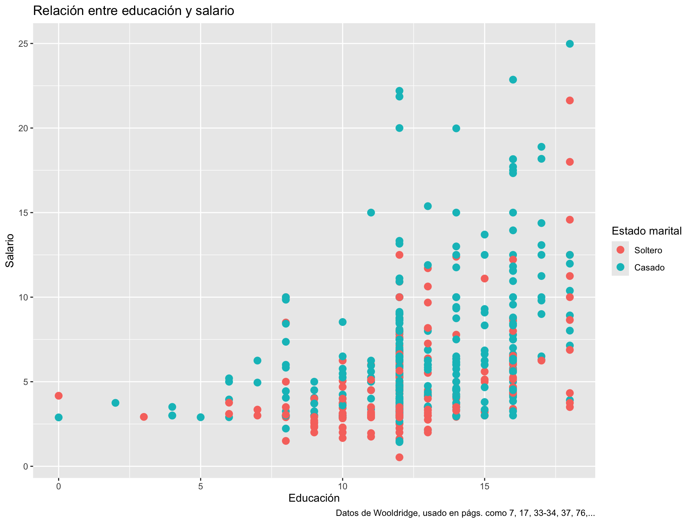

**Inferencia estadística**

Este taller está basado en elementos y ejemplos del libro de Rafael
Irizarry, [aquí](https://rafalab.dfci.harvard.edu/dslibro), así como
pedazos del curso de la Universidad de la República, en Uruguay,
disponible en esta página de [RPubs de
RStudio](https://rpubs.com/lercy/930251) y este repaso sobre modelos
longitudinales por Alessio Crippa también en [RPubs de
RStudio](https://rpubs.com/alecri/review_longitudinal).

*Si aún no has instalado R, está [aquí](http://cran.us.r-project.org/).
Acto seguido, [baja
RStudio](https://posit.co/download/rstudio-desktop/). Puedes también ir
a la nube [en Posit Cloud](https://posit.cloud/).*

# Recapitulando

La vez anterior, tomamos un recorrido a través de distintos tipos de
visualizaciones. En efecto, una buena visualización puede demostrar
bastante sobre factores en nuestros estudios. Por ejemplo

```{r Cargando datos de Wooldridge}
library(wooldridge)

data(wage1)
head(wage1)

```

¿Qué aprendemos de ver estos datos así? ¿Podemos rápidamente determinar
a si años de educación se traducen a mayores ingresos? ¿Podemos
determinar si afecta en algo la relación marital? Para muchos humanos,
es difícil extraer información con meramente mirar a números sin
contexto adicional. Pero podríamos ver algo en este gráfico



Vivimos en una era de creciente disponibilidad de conjuntos de datos
informativos y de herramientas de software, con lo cual el uso de
visualizaciones ha aumentado en diversos espacios: académicos,
gubernamentales, organizaciones sociales, prensa, e industrias varias.

En R, un programa estadístico diseñado para la ejecución de distintos
formatos de estadísticas, tenemos un sinnúmero de opciones para
distintos tipos de complejidades en datos y análisis.

Esta fue una secuencia de tres semanas, y en esta lección continuamos de
lo aprendido en el pasado; retomamos problemas que visualizamos aunque
no fuera satisfactorio, para analizarlos con análisis estadísticos y
visualizaciones relativas a la inferencia estadística. Aprenderemos hoy:

1.  Varias operaciones estadísticas,

2.  estadística inferencial, en sus varias versiones para modelos
    simples, lineales, jerárquicos y longitudinales.

3.  gráficos que ayuden a entender y diagnosticar los modelos
    estadísticos que usaremos

# Modelos estadísticos

Queríamos entender la vez anterior la relación de ingreso con otras
variables. Para cargar los datos escribiremos

```{r}
library(wooldridge)
base <- wage1
#View(base) 
names(base)
?wage1
```

Las variables que utilizaremos son las siguientes:

-   wage: salario promedio por hora.

-   educ: años de educación.

-   exper: años de experiencia potencial.

-   tenure: años con el empleador actual (antigüedad).

-   nonwhite: es igual a 1 si la persona no es blanca, 0 si no.

-   female: es igual a 1 si la persona es mujer, 0 si no

-   married: es igual a 1 si la persona es casada, 0 si no.

En primer lugar queremos cambiar el nombre de la variable que está en la
posición 4:

```{r}
names(base)[4] <- "antigüedad"
names(base)[24] <- "antigüedadcuad"

```

Por ahora lo que nos interesaba es un subconjunto de variables, todas de
la 1 a la 7 (la 4.ª ha quedado como antigüedad), la 22 (log. de
salario), la 23 (experiencia al cuadrado) y la 24 (la antigüedad al
cuadrado).

```{r, Selección de variables}
base1 <- base[,c(1: 7, 22:24)] 
```

Veremos ahora las primeras filas

```{r}
head(base1, n = 10)
```

También podríamos llamarlos con el nombre de variable

```{r, subconjuntos básicos}
datos1 <- base[,c("wage","educ","exper", "antigüedad" )] 

head(datos1, n = 5)
```

o como cubrimos al tocar `tidyverse`, la función `select()`

```{r, Select()}
library(tidyverse)
datos2 <- base %>% select("wage", "educ", "exper", "antigüedad")
head(datos2, n=7)


```

Si solamente quisiéramos los datos de los casados podríamos usar la
función de filtrado

```{r, Sólo casados}
datos3 <- base %>% 
  select("wage", "educ", "exper", "antigüedad", "married") %>% 
  filter(married == 1)
```

# Correlaciones

Para investigar si hay correlación entre alguna de las variables se
puede realizar un gráfico en el que se presenta la dispersión para cada
par de variables.

```{r, Correlaciones}
plot(datos2)
```

Y también calcular la matriz de correlaciones de las variables que
figuran en *datos2*.

```{r, Correlaciones 2}
cor(datos2)
```

Notamos que existe una correlación positiva entre el salario y la
educación (0.4059)

Crearemos el diagrama de dispersión entre salario y educación utilizando
las funciones de la librería ggplot2.

```{r}
ggplot(datos2, aes(x = educ, y = wage)) + 
  geom_point() + theme_light() +
  ggtitle("Relación entre salario y educación")
```

Se acordarán que la vez anterior añadimos complicaciones como un nivel
adicional en la capa de color:

```{r}
wage1 |> 
  mutate(marital = factor(married, levels = c(0, 1), labels = c("Soltero", "Casado"))) |> 
  ggplot(aes(educ, wage)) +  geom_point(aes(colour = marital), size = 3)+
  labs(title="Relación entre educación y salario",
       x = "Educación", 
       y = "Salario",
       color = "Estado marital",
       caption = "Datos de Wooldridge, usado en págs. como 7, 17, 33-34, 37, 76,...")

```

Esto lo exploraremos más al entrar en modelos de regresión lineal
múltiple. Empezaremos por el modelo de regresión lineal simple.

# Modelo de regresión lineal simple

Estimamos un modelo de regresión lineal simple, con el método mínimos
cuadrados ordinarios (en adelante MCO, OLS en inglés) que explique los
salarios en función de los años de educación de las personas. En R esto
se hace con la función `lm()`:

```{r, MCO}
mod1 <- lm(wage ~ educ, data=datos2)
summary(mod1) # para imprimir la salida
```

¿Cómo se lee esta salida? La primera línea indica la fórmula que se
utilizó. La segunda es sobre la distribución de residuos las diferencias
entre los valores observados de `wage` y los valores predichos por el
modelo. La mediana cercana a cero indica que los residuos están
centrados alrededor de cero. El rango de los residuos sugiere que hay
algunos valores atípicos, especialmente en el extremo máximo (16.6085),
lo que podría indicar la presencia de salarios excepcionalmente altos no
explicados completamente por el modelo.

Vamos a los coeficientes: la columna de `Estimate` tiene el valor
estimado de coeficientes, mientras que la columna de `Std. Error` nos da
la desviación estándar estimada de la estimación del coeficiente. El
puntaje t reporta la distancia en distribución t de la muestra,
vis-à-vis otras presunciones (de nulo efecto), con la última columna
proveyendo el valor p, probabilidad asociada al puntaje t.

El intercepto de -0.9 representa el salario promedio cuando los años de
educación son cero. Sin embargo, en la práctica, es poco común que una
persona tenga cero años de educación, por lo que este valor tiene una
interpretación limitada. El valor p es algo elevado, lo que indica que
no podríamos afirmar con certeza su diferencia de cero. El coeficiente
en educación indica que cada año en educación (una unidad adicional) se
traduciría en un aumento de 0.54136 unidades en salario (si son pesos,
pues 54 chavos). El valor p es bajo (o el puntaje t es elevado, distante
a 2), lo que indica con cierta certeza que el estimado no es cero. Vemos
esto acompañado con asteriscos, que indican el nivel de significancia,
atado al valor seleccionado $\alpha$.

El modelo luego continúa reportando otros diagnósticos generales:\
- Residual standard error (Error estándar de los residuos): más o menos 3.378

-- Indica la variabilidad promedio de los residuos; en otras palabras,
mide la precisión del modelo. Esto sugiere que las predicciones individuales del salario pueden variar en promedio ±3.378 unidades del valor real.


- Degrees of freedom (Grados de libertad): 524
-- Calculado como el número de observaciones menos el número de parámetros estimados (n - k - 1).

- El coeficiente de determinación (R cuadrado) nos da 0.1648, que indica que el 16.48% de la variabilidad se explica con el modelo. El R cuadrado ajustado es similar. Este penaliza la inclusión de términos adicionales. 

- El estadístico F y el valor p global evalúa la hipótesis nula de que todos los coeficientes sean iguales a cero.

y el análisis de varianzas se calcula con la función `anova()`:

```{r}
anova(mod1) # para imprimir el análisis de varianzas
```

Este análisis descompone la variabilidad total de la variable dependiente (`wage` en este caso) en componentes atribuibles al modelo y a los residuos. Te permite evaluar la significancia global del modelo y del predictor incluido. 

El objeto creado a través de la función `lm()`, de clase lm, tiene en sí
doce objetos:

```{r, adentro del modelo}
names(mod1)

```

Se puede acceder a ellos como a las variables dentro de un objeto,
utilizando el operador `$` entre el objeto y el elemento. Por ejemplo,
para extraer los coeficientes estimados se escribe lo siguiente:

```{r, coeficientes}
mod1$coefficients
```

Para consultar la estimación de un coeficiente de regresión se utilizan
paréntesis rectos y se indica la ubicación del mismo dentro de la salida
del `summary()`. Alfa hat (es decir, el alfa gorro o el alfa estimado)
se saca:

```{r}
ahat <- coef(summary(mod1))[1,1]
ahat
```

Y el beta hat, beta gorro o beta estimado es:

```{r}
bhat <- coef(summary(mod1))[2,1]
bhat
```

Podemos sacar los próximos pasos:

```{r}
coeficientes <- mod1$coefficients
ygorro <- mod1$fitted.values
resid <- mod1$residuals
```

Por último, podemos agregar al conjunto de datos original las
predicciones, en este caso salario estimado, que se obtienen con la
función `predict()`.

```{r}
datos2$predicciones <- predict(mod1) 
head(datos2, 5)
```

El gráfico de dispersión puede establecerse

```{r}
ggplot(datos2, aes(x = educ, y = wage)) + 
  geom_point() +
  geom_smooth(method = 'lm', formula = y ~ x, se = FALSE, col = 'dodgerblue1') +
  theme_light() +
  ggtitle("Relación entre salario y educación")
```

Si quisiéramos un gráfico de dispersión interactivo, podemos usar
plotly. Así, posicionándose encima de cada observación, se ven los
valores de (x, y) para cada uno de los individuos. Para construir dicho
gráfico se necesita la función ggplotly() del paquete plotly.

```{r}
library(plotly)

ggplotly(data = datos2, x = ~ educ, y = ~ wage)
```

En la evaluación de un modelo lineal tenemos que entender que tiene una
serie de presunciones.

1.  **Linealidad**: La relación entre las variables dependiente e
    independiente debe ser lineal, es decir, puede ser representada como
    una línea recta en el plano de coordenadas.

2.  **Independencia de los errores**: Los residuos o errores (la
    diferencia entre los valores observados y los valores predichos por
    el modelo) deben ser independientes entre sí. Esto significa que no
    debe haber correlación entre los errores.

3.  **Homoscedasticidad**: La varianza de los errores debe ser constante
    a lo largo de todos los valores de las variables independientes.
    Esto implica que la dispersión de los residuos debe ser la misma a
    lo largo del rango de valores de la variable independiente.

4.  **Normalidad de los errores**: Los errores deben seguir una
    distribución normal. Este supuesto es importante para la realización
    de pruebas de hipótesis y la construcción de intervalos de
    confianza.

5.  **No multicolinealidad**: Las variables independientes no deben
    estar altamente correlacionadas entre sí. La multicolinealidad puede
    dificultar la estimación precisa de los coeficientes de regresión.

De violarse estas presunciones, el modelo estará sesgado y sus
resultados no serán del todo fiables.

Podremos revisar algunos de estos a través de varios métodos: Podemos
por ejemplo calcular los residuos del modelo simple y los agregamos al
conjunto de datos (*datos2*) de la siguiente forma:

```{r}
datos2$residuos <- datos2$wage - datos2$predicciones
head(datos2, 5)
```

Comparamos los residuos calculados manualmente con los que nos dio el
modelo. En este caso añadimos la complicación al modelo de los valores
estimados de y, $\hat{y}_i$, en rojo y muestro los residuos $\hat{u}_i$:

```{r}
resid <- mod1$residuals
datos2$resid <- resid
datos2$verif <- datos2$residuos - datos2$resid

ggplot(datos2, aes(x = educ, y = wage)) +
  geom_smooth(method = "lm", se = FALSE, color = "lightgrey") +
  geom_segment(aes(xend = educ, yend = predicciones), col = 'red', lty = 'dashed') +
  geom_point() +
  geom_point(aes(y = predicciones), col = 'red') +
  theme_light()
```

Podemos realizar un gráfico de dispersión para inspeccionar de forma
gráfica los residuos.

```{r}
plot(datos2$residuos)
```

```{r}
library(e1071)  # para la función skewness
par(mfrow = c(1, 2))  # divide el área de gráficos en 2 columnas

plot(density(datos2$wage), main = "Gráfico de densisdad: salario", ylab = "Frecuencia", sub = paste("Asimetría:", round(e1071::skewness(datos2$wage), 2)))  # density para 'salario'

polygon(density(datos2$wage), col = "red")

plot(density(datos2$residuos), main = "Gráfico de densisdad: residuos", ylab = "Frecuencia", sub = paste("Asimetría:", round(e1071::skewness(datos2$residuos), 2)))  # density para los 'residuos'

polygon(density(datos2$residuos), col = "red")
```

A partir de los datos con los que se viene trabajando, vamos a generar
la predicción puntual y el intervalo de confianza para una educación de
10 años.

Primero, calculamos el salario esperado para una persona con la
educación promedio: $\frac{y}{x}=\bar{x}$.

```{r}
mean(datos2$educ)
sal_pred <- 0.90485 + 0.054136 * 12.56
sal_pred
```

En segundo lugar, calculamos el intervalo de confianza para una persona
con la educación promedio ($𝑥=12.56$) El argumento
`interval = prediction` devuelve el valor para la predicción puntual.

```{r}
nuevo <- data.frame(educ = 12.56)
future_y <- predict(object = mod1, newdata = nuevo, interval = "prediction", level = 0.95)
```

Luego, generamos el intervalo de confianza para $𝐸(𝑦/𝑥)$. en este caso,
debemos cambiar el argumento a `interval = "confidence"`.

```{r}
future_esp_y <- predict(object = mod1, newdata = nuevo, interval = "confidence", level = 0.95)
future_esp_y <- as.data.frame(future_esp_y)

IC_inf_esp_y <- future_esp_y$lwr
IC_sup_esp_y <- future_esp_y$upr
```

Agregando los pedazos

```{r}
nuevos_datos <- cbind(datos2, future_y, IC_inf_esp_y, IC_sup_esp_y)
```

Finalmente, generamos los gráficos correspondientes con los intervalos
de confianza para la predicción puntual (`IC_y`) y para el valor
esperado (`IC_esp_y`) con el siguiente código:

```{r}
IC_y <- ggplot(nuevos_datos, aes(x = educ, y = wage)) +
  geom_point() +
  geom_line(aes(y = lwr), color = "red", linetype = "dashed") +
  geom_line(aes(y = upr), color = "red", linetype = "dashed") +
  geom_smooth(method = lm, formula = y ~ x, se = TRUE, level = 0.95, col = 'blue', fill = 'pink2') +
  theme_light() + 
  ggtitle("Predicción de y al 95%")

IC_esp_y <- ggplot(nuevos_datos, aes(x = educ, y = wage)) +
  geom_point() +
  geom_line(aes(y = IC_inf_esp_y), color = "blue", linetype = "dashed") +
  geom_line(aes(y = IC_inf_esp_y), color = "blue", linetype = "dashed") +
  geom_smooth(method = lm, formula = y~x, se = TRUE, level = 0.95, col = 'blue', fill = 'pink2') +
  theme_light() + 
  ggtitle("Predicción de E(y/x) al 95%")
```

Imprimimos los gráficos uno al lado del otro, para poder compararlos
mejor. ¿Cuál de los dos tiene mayor amplitud?

```{r}
library(gridExtra)

grid.arrange(IC_esp_y, IC_y, ncol = 2, nrow = 1)
```

Veamos, a través de la comparación de dos gráficos el impacto que tiene
el nivel de confianza en la amplitud de los intervalos. Para ello,
tendremos que descargar e instalar algunas librerías. Se presenta
primero el código y luego los gráficos obtenidos.

```{r}
library(jtools)
library(ggstance)
library(broom.mixed)

a <- plot_summs(mod1, escala = TRUE, plot.distributions = TRUE, inner_ci_level = .90)
b <- plot_summs(mod1, escala = TRUE, plot.distributions = TRUE, inner_ci_level = .7) 

grid.arrange(a, b, ncol = 1, nrow = 2)
```

## Regresión múltiple

Digamos que queremos evaluar la relación de varias variables con la
dependiente. Podemos calcular las correlaciones de los pares de
variables, indicando que queremos trabajar con 3 decimales:

```{r}
round(cor(base1, method = "pearson"), 3)

```

Podemos analizar varias variables en un grafo interactivo

```{r}
library(ggplot2)
library(plotly)
attach(base1)
plot_ly(x = educ, y = antigüedad, z = wage, type = "scatter3d", color = wage) %>% 
  layout(scene = list(xaxis = list(title = 'educación (en años)'),
                      yaxis = list(title = 'antigüedad (en años)'),
                      zaxis = list(title = 'Salario (en USD/h)')))
```

```{r}
library(scatterplot3d)
graf <- scatterplot3d(x = educ, y = antigüedad, z = wage, pch = 16, 
              cex.lab = 1, highlight.3d = TRUE, type = "h", 
              xlab = 'Años de educación',
              ylab = 'Antigüedad (años)', 
              zlab = 'Salario (USD/h)')
```

Estimar el modelo múltiple:

```{r}
mod2 <- lm(wage ~ educ + antigüedad, data = base1)
summary(mod2)
```

```{r}
graf <-  scatterplot3d(x = educ, y = antigüedad, z = wage, pch = 16, 
                     cex.lab = 1, highlight.3d = TRUE, type = "h", 
                     xlab = 'Años de educación',
                     ylab = 'Experiencia (años)', 
                     zlab = 'Salario (USD/h)')

graf$plane3d(mod2, lty.box = "solid", col = 'mediumblue')
```

Analizando varianza del modelo

```{r}
anova(mod2)
```

## Análisis de la bondad del modelo

Podemos evaluar el modelo gráficamente con la función `plot()`:

```{r}
plot(mod2)
```

Notamos que el modelo tiene sus problemas, violentando varios de los
principios señalados antes.

```{r}
library(e1071)  # librería necesaria para utilizar la función skewness()

plot(density(mod2$residuals), 
     main = "Gráfico de densidad de residuos", ylab = "Frecuencia", 
     sub = paste("Asimetría:", round(e1071::skewness(mod1$residuals), 2)))  

polygon(density(mod2$residuals), col = "red")
```

Por ejemplo, estos residuos distan de ser normales. Las cuantilas de los
residuos distan de la normalidad esperada.

```{r, Prueba Shapiro}
shapiro.test(mod2$residuals)
```

La hipótesis nula de la prueba de Shapiro-Wilk es que estamos ante
normalidad en los errores. Esto confirma lo sugerido por el análisis
gráfico precedente.

En los siguientes gráficos se muestran los residuos contra cada uno de
los regresores, los cuales se realizan con el siguiente código:

```{r}
plot1 <- ggplot(data = base1, aes(educ, mod1$residuals)) +
  geom_point() + 
  geom_smooth(color = "firebrick") + 
  geom_hline(yintercept = 0) +
  theme_bw()

plot2 <- ggplot(data = base1, aes(antigüedad, mod1$residuals)) +
  geom_point() + 
  geom_smooth(color = "firebrick") + 
  geom_hline(yintercept = 0) +
  theme_bw()

grid.arrange(plot1, plot2)
```

El análisis gráfico indica problemas de heteroscedasticidad y de
correlación entre los residuos y el nivel de los regresores.

Una manera resumida de verlo es graficando los residuos contra los
valores ajustados de $y$, que es una combinación lineal de los
regresores que estamos considerando.

```{r}
ggplot(data = base1, aes(mod1$fitted.values, mod1$residuals)) +
  geom_point() +
  geom_smooth(color = "firebrick", se = FALSE) +
  geom_hline(yintercept = 0) +
  theme_bw()
```

Los problemas señalados antes se ven igual.

```{r}
mod3<-update(mod2,wage~educ+antigüedad+married)
summary(mod3)

```

Veamos los coeficientes

```{r}
library(modelsummary)
modelplot(mod3, coef_omit="Intercept", color="blue", size=1) +
  labs(title="Coeficientes crudos del modelo 3")
```

En este caso algunos de estos quizás no sean visualmente buenos para
comparar: usan escalas distintas: uno es un efecto neto del ser o no
casado, mientras otros usan escalas numéricas significativas.
Estandaricemos esto para fin de entender el efecto real.

```{r}
base1_estandarizado <- base1 %>%
  as_tibble() %>%
  mutate(across(where(is.numeric), scale))

mod3.1<-update(mod3,data=base1_estandarizado)

modelplot(mod3.1, coef_omit="Intercept", color="blue", size=1) +
  labs(title="Coeficientes estandarizados del modelo 3")
```

¿Será igual de problemático el modelo? Podemos Al ejecutar plot(modelo)
en R, se generan cuatro gráficos diagnósticos que ayudan a evaluar la
adecuación y los supuestos del modelo ajustado. A continuación, los
veremos, y luego describo cómo interpretarlos:

```{r}
plot(mod3)
```

1.  Residuos vs Ajustados (Residuals vs Fitted):

    • Qué muestra: Este gráfico representa los residuos estandarizados
    en función de los valores ajustados por el modelo. • Interpretación:
    Sirve para detectar patrones no lineales y evaluar la homogeneidad
    de la varianza (homocedasticidad). Si los puntos se distribuyen
    aleatoriamente alrededor de la línea horizontal (residuo = 0) sin
    formar patrones, indica que el modelo es adecuado. Patrones
    sistemáticos o formas específicas (como una curva) sugieren que el
    modelo no captura adecuadamente la relación entre las variables, o
    que existe heterocedasticidad.

2.  Gráfico Q-Q Normal (Normal Q-Q Plot):

    • Qué muestra: Compara la distribución de los residuos
    estandarizados con una distribución normal teórica. •
    Interpretación: Evalúa la normalidad de los residuos, un supuesto
    clave en modelos lineales. Si los puntos siguen aproximadamente una
    línea recta, los residuos se distribuyen normalmente. Desviaciones
    significativas de la línea recta indican que los residuos no son
    normales, lo que puede afectar la validez de los intervalos de
    confianza y pruebas de hipótesis.

3.  Escala-Ubicación (Scale-Location Plot):

    • Qué muestra: Grafica la raíz cuadrada de los residuos
    estandarizados (sqrt(\|Residuos estandarizados\|)) frente a los
    valores ajustados. • Interpretación: Ayuda a verificar la
    homocedasticidad. Una dispersión uniforme de puntos sugiere varianza
    constante de los residuos. Si los puntos muestran un patrón (por
    ejemplo, se ensanchan o estrechan a lo largo del eje de los
    ajustados), indica heterocedasticidad, lo que puede afectar la
    eficiencia de los estimadores.

4.  Residuos Estandarizados vs Apalancamiento (Residuals vs Leverage):

    • Qué muestra: Muestra los residuos estandarizados frente al
    apalancamiento de cada observación, con curvas de distancia de Cook
    superpuestas. • Interpretación: Identifica observaciones influyentes
    que tienen un gran impacto en el ajuste del modelo. Puntos con alto
    apalancamiento y residuos grandes pueden distorsionar los
    resultados. Las líneas de distancia de Cook ayudan a detectar estos
    puntos. Observaciones más allá de estas líneas merecen una revisión
    adicional.

Verifiquemos matemáticamente esto

```{r}
shapiro.test(mod3$residuals)
```

Parece que el modelo no mejora en la normalidad de residuos.

```{r}
library(stargazer)
stargazer(mod1,mod2,mod3) #de base, para LaTeX
```

```{r}
stargazer(mod1,mod2,mod3, type="text", title = "Resultados de regresión") #de base, para LaTeX
```

# Modelos lineales generalizados

Al trabajar con datos como los de Wooldridge de salarios, notamos que
hay unos problemas con las presunciones de cuadrados menores. Si bien
obtenemos resultados, estos pueden ser problemáticos al estar sesgados
por la falta de precisión en los modelos en relación a los errores, que
no parecen estar bien distribuidos. Eso significa que las inferencias
podrían no ser adecuadas.

Sabiendo que la regresión lineal predice directamente una respuesta
continua a partir del predictor lineal, $𝑋𝛽$, un MLG o GLM extiende este
esquema de predicción lineal. Este consiste en:

```         
•   Un **predictor lineal** $𝑋𝛽$.

•   Una **función de enlace** $𝑔$, que es monótona y diferenciable en todo su dominio, y que transforma el predictor lineal: $𝑦̂ = 𝑔⁻¹(𝑋𝛽̂$).

•   Una **distribución de respuesta**: $𝑓(𝑦\|𝜇)$ de la familia exponencial,
```

con valor esperado $𝜇 = 𝑔⁻¹(𝑋𝛽)$.

Esto proporciona flexibilidad para modelar diferentes tipos de variables
dependientes (respuestas), permitiendo que el modelo capture mejor las
características de los datos.

La función `glm()` en R se utiliza para ajustar **Modelos Lineales
Generalizados (GLM en inglés)**, que son una extensión de los modelos
lineales ordinarios (OLS). Estos modelos permiten manejar diferentes
tipos de variables de respuesta (dependientes), como binomiales,
Poisson, y gamma, entre otras. El modelo se define en función de:

-   Una **función de enlace** que describe la relación entre las
    variables independientes y la media de la variable dependiente.

-   Una **distribución** de la variable dependiente que puede no ser
    normal.

Los GLMs son útiles cuando el rango de la variable de respuesta está
limitado y/o la varianza no es constante o normalmente distribuida. Los
modelos GLM transforman la variable de respuesta para permitir el ajuste
mediante mínimos cuadrados. La transformación aplicada a la variable de
respuesta está definida por la función de enlace. Esta transformación
puede restringir el rango de la variable de respuesta. La función de
varianza especifica la relación entre la varianza y la media. En R, una
familia especifica las funciones de varianza y enlace que se utilizan en
el ajuste del modelo. Por ejemplo, la familia “poisson” usa la función
de enlace “log” y toma “$μ$” como la función de varianza. Un modelo GLM
se define tanto por la fórmula como por la familia.

Los modelos GLM también pueden ajustarse a datos en los que la varianza
es proporcional a una de las funciones de varianza definidas. Esto se
hace con las familias cuasi, donde el χ² de Pearson (chi-cuadrado) se
utiliza para escalar la varianza. Un ejemplo sería cuando la varianza es
proporcional a la media. Esto usaría la familia “quasipoisson”. Esto
resulta en una función de varianza de αμ en lugar de $1/μ$ como en los
datos distribuidos según Poisson. Las familias cuasi permiten hacer
inferencias cuando tus datos están sobredispersos o subdispersos,
siempre que la varianza sea proporcional.

La función de enlace predeterminada para una familia puede cambiarse
especificando un enlace a la función de familia. Por ejemplo, si la
variable de respuesta es no negativa y la varianza es proporcional a la
media, se usaría la función de enlace “identity” con la familia
“quasipoisson”. Esto se especificaría como:

``` r
family = quasipoisson(link = "identity")
```

La decisión sobre qué familia es apropiada no se discute en esta
secuencia, pero estos pueden ser:

``` r
binomial(link = "logit")
gaussian(link = "identity")
Gamma(link = "inverse")
inverse.gaussian(link = "1/mu^2")
poisson(link = "log")
quasi(link = "identity", variance = "constant")
quasibinomial(link = "logit")
quasipoisson(link = "log")
```

Revisar la página de ayuda de `glm` y la documentacion de objetos
familiares para modelos ayudará en gran medida.

**Sintaxis básica de glm()**

``` r
glm(formula, family = family_type(link = link_function), data = dataset)
```

-   `formula`: Especifica la relación entre las variables dependiente e
    independientes (similar a `lm()`).

-   `family`: Define la distribución de la variable dependiente. Puede
    ser `gaussian` (para regresión lineal), `binomial` (para regresión
    logística), `poisson` (para modelos de conteo), `gamma`, entre
    otros.

-   `link`: Es la función de enlace que conecta la media de la variable
    dependiente con las variables independientes (por ejemplo, `log`,
    `identity` o `inverse`).

```{r}
# Ajustando un modelo GLM con distribución gamma y enlace logarítmico
mod_glm <- glm(wage ~ educ + antigüedad + married, 
               family = Gamma(link = "log"), 
               data = base1)

# Resumen del modelo
summary(mod_glm)
```

```{r}
# Transformar wage a su logaritmo (eliminando ceros o valores negativos en wage)
base1 <- base1[base1$wage > 0, ]
base1$lwage <- log(base1$wage)

# Ajustando un modelo OLS con log(wage) como variable dependiente
mod_logwage <- lm(lwage ~ educ + antigüedad + married, data = base1)

# Resumen del modelo
summary(mod_logwage)
```

Notamos que la transformación aproxima los coeficientes a los
conseguidos con el `glm()`.

```{r}
library(arm)
arm::coefplot(mod_glm, col.pts="red", cex.pts=1.5)
arm::coefplot(mod_logwage, add=TRUE, col.pts="blue", cex.pts=1.5)
```

## Análisis de la bondad del modelo

```{r}
plot(mod_glm)
```

Esto se ve posiblemente mejor que la variante de OLS, aunque tampoco
parece perfecto.

# Modelos jerárquicos

El paquete `lme4` está bien adaptado para los Modelos Jerárquicos
Lineales “normales” con grupos anidados. La sintaxis de `lme4` se basa
en la sintaxis de los modelos lineales que ya conocemos de `lm()`.

La función `lmer()` de `lme4` añade la especificación de la variable de
grupo/sujeto y de la estructura de efectos aleatorios que se van a
estimar. En paréntesis adicionales (ver abajo), el término a la
izquierda de `|` especifica los efectos aleatorios que se van a estimar.
El término a la derecha de `|` representa la(s) variable(s) que definen
la estructura de agrupación (o anidamiento) de los datos.

Un `1` en la parte izquierda del paréntesis significa que se debe
estimar un componente de varianza de intercepto aleatorio. Si también se
coloca la variable predictora a la izquierda de `|`, esto indica que se
deben incluir pendientes aleatorias. La forma básica de estos será:

``` r
lmer(data = datos, VarDependiente ~ VarIndependiente + (1 | VarGrupal))
```

Corresponde a un modelo que puede describirse de la siguiente manera:
“La variable dependiente es predicha por la variable independiente. Al
mismo tiempo, la varianza de los residuos de nivel 2 del intercepto es
un parámetro del modelo”.

Comencemos con modelos HLM que incluyen solo variables predictoras de
nivel 1 (individuos anidados en grupos). Luego, en un segundo paso,
añadiremos predictores de nivel 2. Finalmente, analizaremos los modelos
HLM de medidas repetidas, donde el nivel más bajo (nivel 1) corresponde
a observaciones repetidas dentro de los individuos, y esas observaciones
están anidadas en los participantes individuales (nivel 2).

Nos limitaremos aquí a modelos de 2 niveles. Los principios de los
modelos HLM pueden ilustrarse de manera bastante parsimoniosa de esta
forma, y expandir los modelos a más de dos niveles de análisis es
bastante sencillo.

```{r}
library(tidyverse)
df <- read_csv(
  url("https://raw.githubusercontent.com/methodenlehre/data/master/salary-data.csv"))
df <- df %>%
  mutate(firma = as.factor(firma),
         sector = as.factor(sector))
tail(df)
```

```{r}
library(Matrix)
library(lme4)
modelo.intercepto <- lmer(salary ~ 1 + (1 | firma), data = df, REML = TRUE)

# Aquí, las predicciones del modelo corresponden al salario promedio de cada empresa.
# Almacenamos estos valores predichos (por persona/fila) para graficarlos más tarde.
df$predicciones.intercepto <- predict(modelo.intercepto)

# Resultados del modelo
summary(modelo.intercepto)
```

Con la función ranef() podemos ver los efectos aleatorios (residuos de segundo nivel del intercepto):

```{r}
ranef(modelo.intercepto)
```

Correlación intraclase

La correlación intraclase cuantifica el grado de “no independencia” en la variable dependiente debido a diferencias sistemáticas de nivel 2 en la característica medida. Cuanto mayor sea la proporción de la varianza del nivel 2 (varianza de los promedios de grupo) con respecto a la varianza total (suma de la varianza del nivel 2 y la varianza del nivel 1 o varianza residual), mayores serán las similitudes dentro de las unidades del nivel 2 en comparación con las unidades entre niveles 2.

La correlación intraclase se define como: 
$\rho = \frac{\sigma^2_{\text{Nivel-2}}}{\sigma^2_{\text{Nivel-2}} + \sigma^2_{\text{Nivel-1}}}$

La correlación intraclase se obtiene estimando un modelo nulo (modelo solo con intercepto, ver arriba), en el cual tanto la varianza (aleatoria) del intercepto (en un modelo sin predictores, esto corresponde a la varianza de los promedios de grupo) como la varianza residual del nivel 1 son parte de la salida.

Correlación intraclase: 
$\hat{\rho} = \frac{\hat{\sigma}^2_{υ_0}}{\hat{\sigma}^2_{υ_0} + \hat{\sigma}^2_{ϵ}} = \frac{851249}{851249 + 1954745} = 0.3034$

Aproximadamente, el 30% de la varianza total del salario se puede atribuir a diferencias entre empresas.

Prueba de significancia para $\sigma^2_{υ_0}$: Comparación del modelo con un “modelo nulo absoluto” (modelo solo con intercepto fijo $\gamma_{00}$).

Ya conocemos la varianza de nivel 2 de la variable dependiente salary, pero aún no tenemos una prueba de significancia para este parámetro. Podemos obtener una prueba de significancia comparando el modelo solo con intercepto con un modelo que no contiene interceptos aleatorios, es decir, con un “modelo lineal normal” sin un predictor (donde la media total $\gamma_{00}$ es el único parámetro del modelo además de la varianza residual de nivel 1 $\sigma^2_{ϵ}$). Este modelo también se llama “modelo nulo absoluto”. No necesitamos especificar explícitamente dicho modelo, ya que podemos aplicar la función ranova() al objeto de salida intercept.only.model. La función `ranova()` (del paquete auxiliar lmerTest para lme4) realiza automáticamente comparaciones de modelos (solo) para efectos aleatorios eliminando paso a paso los efectos aleatorios existentes y luego comparando el modelo resultante con el modelo reducido. En este caso, solo se puede eliminar un efecto aleatorio, que es el del intercepto.

```{r}
library(lmerTest)
ranova(modelo.intercepto)
```
La comparación de modelos es significativa (p < 0.001). Incluso podemos dividir el valor p por 2, ya que la comparación corresponde en realidad a una prueba de una sola cola. El parámetro $\sigma^2_{υ_0}$ tiene un espacio de parámetros acotado (no puede ser negativo).

Añadamos ahora un predictor de primer nivel como efecto fijo, con un intercepto aleatorio. Esto es útil para determinar la proporción de varianza explicada por un predictor de primer nivel.

```{r}
modelo.intercepto.aleatorio <-  lmer(salary ~ experience + (1 | firma), 
                                     data = df, REML = TRUE)

df$predicciones.intercepto.aleatorio <-  predict(modelo.intercepto.aleatorio)

summary(modelo.intercepto.aleatorio)
```
Los resultados del modelo mixto muestran que el efecto fijo de la experiencia es significativamente positivo, con un coeficiente estimado de  $\hat{\gamma}_{10} = 534.34$  y un valor $p$ menor a 0.001. Esto indica que, en promedio, el salario aumenta en aproximadamente 534 unidades (por ejemplo, francos suizos) por cada año adicional de experiencia, controlando por las diferencias entre empresas. El modelo incluye un intercepto aleatorio a nivel de empresa (firma), lo que nos permite ajustar diferencias entre las empresas en los salarios base. 

Se le puede añadir un nivel adicional al modelo para tanto acomodar por un intercepto así como pendiente aleatoria. Al aplicar este modelo la varianza (aleatoria) de la pendiente de la variable independiente de primer nivel se puede estimar, dándonos una idea de las diferencias en el efecto (pendiente) de experiencia en salario entre las unidades del segundo nivel (firmas)

```{r}
modelo.coeficientes.aleatorios <-  lmer(salary ~ experience + (experience | firma),
                                        data = df, REML = TRUE)

df$predicciones.coeficientes.aleatorios <-  predict(modelo.coeficientes.aleatorios)

summary(modelo.coeficientes.aleatorios)
```
Los resultados muestran que el efecto fijo de la experiencia sigue siendo significativamente positivo, con un coeficiente estimado de  $\hat{\gamma}_{10} = 530.85$  y un valor $p$ menor a 0.001. Esto indica que, en promedio, el salario aumenta en aproximadamente 531 unidades (por ejemplo, CHF para estos datos ficticios) por cada año adicional de experiencia.

# Modelos longitudinales

La característica clave del análisis de datos longitudinales es el
estudio de datos organizados con observaciones repetidas
tomadas de los mismos individuos. A menudo, el objetivo principal es
caracterizar el cambio en la respuesta a lo largo del tiempo (o
mediciones) y los factores que influyen en este cambio.

Las observaciones que pertenecen al mismo sujeto (o grupo/cluster)
tienden a ser más similares que las observaciones de diferentes grupos.
Es importante tener en cuenta esta correlación para obtener inferencias
válidas.

Los datos longitudinales son un caso especial de datos jerárquicos,
donde las observaciones están anidadas dentro de diferentes niveles
jerárquicamente ordenados, como mediciones dentro de individuos, o
alumnos dentro de escuelas (y dentro de regiones). Una vista general
sobre paquetes útiles en R para analizar este tipo de datos
correlacionados se puede encontrar en la [CRAN Task View
dedicada](https://cran.r-project.org/web/views/MixedModels.html).

Usaré los datos longitudinales de 27 niños (16 niños y 11 niñas) en el desarrollo de las distancias pituitarias-pterigomaxilares durante el crecimiento. Estas medidas se tomaron a las edades de 8, 10, 12 y 14 años, con el objetivo de describir cómo cambia esta distancia con la edad y comparar el patrón de crecimiento entre niños y niñas.

```{r}
load(url("http://alecri.github.io/downloads/data/dental.RData"))
head(dental)
```
Los datos se presentan en formato ancho, donde las mediciones repetidas se encuentran en columnas separadas para cada edad. Este formato no es ideal para el análisis longitudinal, por lo que convertiremos los datos a un formato largo usando la función pivot_longer():
```{r}
library(labelled)   # etiquetado de datos
library(rstatix)    # estadísticas descriptivas
library(ggpubr)     # estadísticas descriptivas y gráficos convenientes
library(GGally)     # gráficos avanzados
library(car)        # útil para ANOVA/pruebas de Wald
library(Epi)        # fácil obtención de intervalos de confianza para coeficientes/predicciones del modelo
library(lme4)       # modelos lineales de efectos mixtos
library(lmerTest)   # pruebas para modelos lineales de efectos mixtos
library(emmeans)    # medias marginales
library(multcomp)   # intervalos de confianza para combinaciones lineales de coeficientes del modelo
library(geepack)    # ecuaciones de estimación generalizadas
library(ggeffects)  # efectos marginales, predicciones ajustadas
library(gt)         # tablas bonitas
dental_long <- pivot_longer(dental, cols = starts_with("y"), 
                            names_to = "measurement", values_to = "distance") %>% 
  mutate(
    age = parse_number(measurement),
    measurement = fct_inorder(paste("Medida a los", age))
  ) %>% 
  set_variable_labels(
    age = "Edad del niño/a al momento de la medición",
    measurement = "Etiqueta de medición temporal",
    distance = "Medición de distancia"
  )

head(dental_long)
```

Evaluando descriptivamente

```{r}
group_by(dental_long, age) %>% 
  get_summary_stats(distance)
```
Parece que el efecto aumenta con la edad. 

```{r}
ggplot(dental_long, aes(measurement, distance, fill = measurement)) +
  geom_boxplot() +
  geom_jitter(width = 0.2) +
  guides(fill = "none") +
  labs(x = "", y = "Crecimiento dental, mm")
```
Veamos si hay diferencias por sexo del paciente dental:
```{r}
group_by(dental_long, sex, measurement) %>% 
  get_summary_stats(distance, show = c("mean", "sd"))
```

Y gráficamente

```{r}
ggplot(dental_long, aes(sex, distance, fill = measurement)) +
  geom_boxplot() +
  labs(x = "", y = "Crecimiento dental, mm", fill = "")
```
Evaluemos las correlaciones entre medidas de interés:

```{r}
ggpairs(select(dental, starts_with("y")), lower = list(continuous = "smooth"))
```

y separemos nuevamente por grupo (sexo)

```{r}
ggpairs(dental, mapping = aes(colour = sex), columns = 3:6,
        lower = list(continuous = "smooth"))
```

Digamos que queremos entender si el efecto varía con el tiempo. Podríamos evaluar gráficamente esto:

```{r}
group_by(dental_long, sex, age) %>% 
  summarise(mean = list(mean_ci(distance)), .groups = "drop") %>% 
  unnest_wider(mean) %>% 
  mutate(agex = age - .05 + .05*(sex == "Boy")) %>% 
  ggplot(aes(agex, y, col = sex, shape = sex)) +
  geom_point() +
  geom_errorbar(aes(ymin = ymin, ymax = ymax), width = 0.2) +
  geom_line() +
  labs(x = "Edad, en años", y = "Crecimiento dental medio, mm", shape = "Sex", col = "Sex")
```

 Una estrategia de modelado para investigar esto es utilizar variables indicadoras para contrastar las respuestas medias en diferentes momentos de la medición.
 
```{r}
lin_age <- lmer(distance ~ measurement + (1 | id), data = dental_long)
summary(lin_age)
```
 Resultados del modelo mixto lineal

Los resultados del modelo mixto muestran lo siguiente:

-	La distancia media dental a los 8 años (valor de referencia) es 22.18 mm.
- La diferencia entre las respuestas medias de los niños de 10 y 8 años es de 0.98 mm.
- La diferencia entre las respuestas medias de los niños de 12 y 8 años es de 2.46 mm.
- La diferencia entre las respuestas medias de los niños de 14 y 8 años es de 3.91 mm.

Esto indica que la distancia pituitaria-pterigomaxilar aumenta significativamente con la edad, lo que es consistente con el crecimiento observado durante este período.

Medias marginales y análisis de varianza

La función emmeans es útil para calcular medias marginales con sus correspondientes intervalos de confianza:
```{r}
tidy(emmeans(lin_age, "measurement"), conf.int = TRUE)
```

Prueba de significancia

Para probar si la respuesta media es constante a lo largo del tiempo, podemos realizar un Análisis de Varianza (ANOVA) para evaluar la hipótesis nula de que todos los coeficientes de regresión utilizados para modelar el tiempo son simultáneamente iguales a cero:

```{r}
Anova(lin_age)
```
Los resultados del test de Wald sugieren que la trayectoria de la respuesta media a lo largo del tiempo no es plana (p < 0.001), lo que significa que existe una variación significativa en la respuesta media con la edad. Podemos presentar la trayectoria estimada del modelo ajustado utilizando la función predict:

```{r}
# Generar predicciones del modelo ajustado
predicciones <- predict(lin_age)

# Visualizar la trayectoria estimada
ggplot(dental_long, aes(x = age, y = distance, color = sex)) +
  geom_point() +
  geom_line(aes(y = predicciones, group = id), linetype = "dashed") +
  labs(x = "Edad (años)", y = "Distancia pituitaria-pterigomaxilar (mm)", color = "Sexo") +
  theme_minimal()
```
Este gráfico muestra tanto los datos reales de distancia en función de la edad como las predicciones del modelo para cada niño, con líneas discontinuas que representan las trayectorias estimadas a lo largo del tiempo.
 
#  Qué aprendimos en este taller final

Aprendimos la existencia de varios modelos, maneras de representar gráficamente sus resultados, y evaluar su utilidad.
